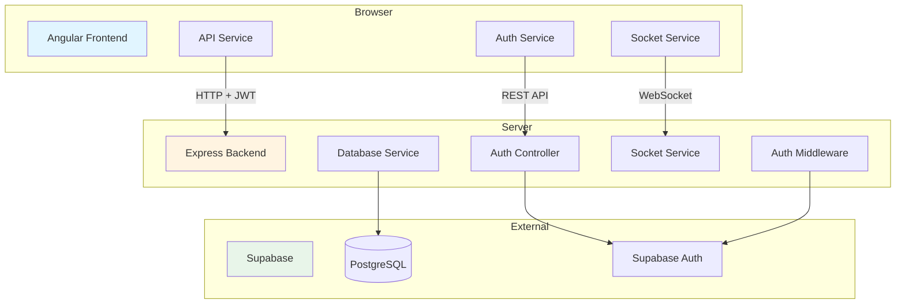
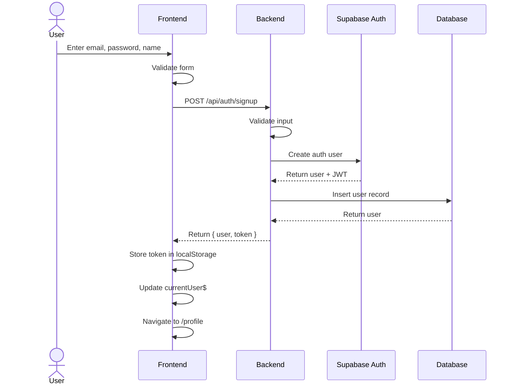
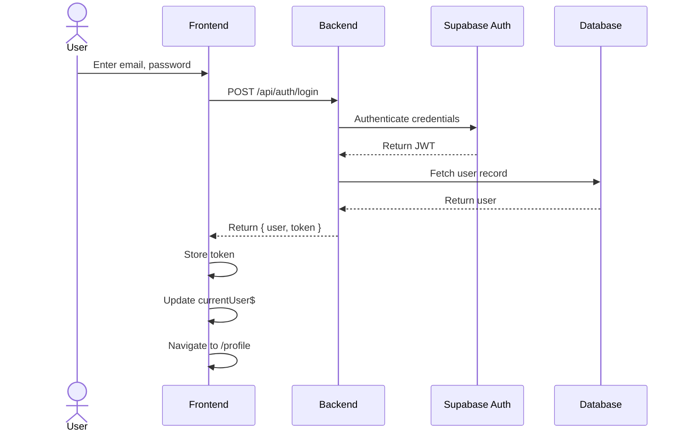
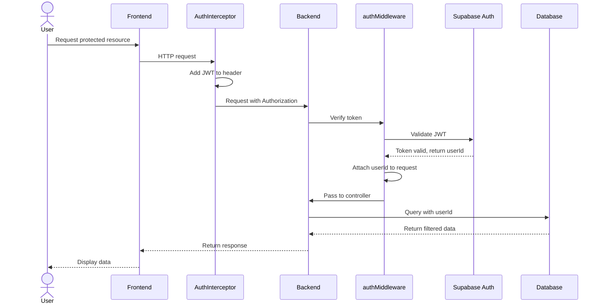
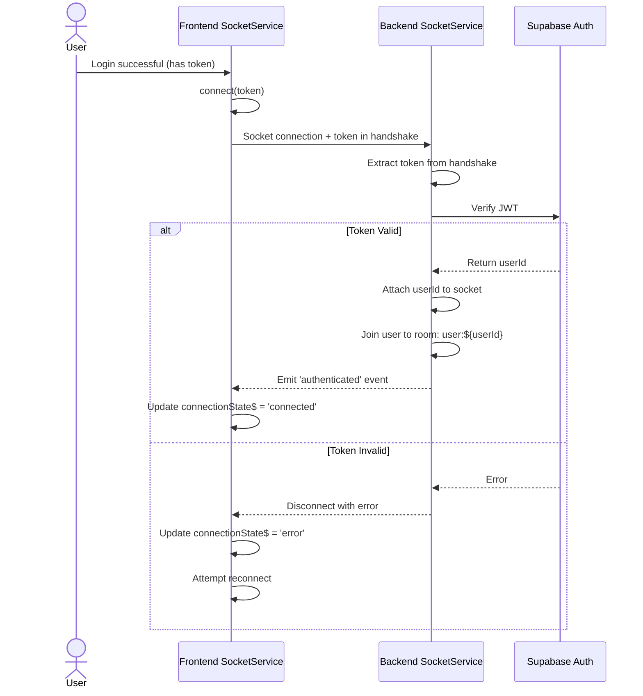

# Design Document - Voice Chat Foundation (Phase 1)

## Overview

This design document describes the technical architecture for Phase 1 of a voice-based English learning chat application. Phase 1 establishes the foundational infrastructure including:

- **Monorepo Structure**: Organized codebase with frontend (Angular), backend (Node.js/Express), and shared TypeScript types
- **Authentication System**: Secure user signup/login using Supabase with JWT tokens
- **Database Layer**: PostgreSQL via Supabase with Row Level Security for data isolation
- **WebSocket Communication**: Real-time bidirectional communication using Socket.IO with authentication
- **Development Workflow**: Hot-reload development servers, ESLint/Prettier, comprehensive documentation

The architecture is designed to support future phases that will add voice processing, AI conversation, and real-time corrections while maintaining clean separation of concerns and type safety across the stack.

**Technology Stack:**
- Frontend: Angular 18+, TypeScript 5+, RxJS
- Backend: Node.js 20+, Express, TypeScript, Socket.IO
- Database: Supabase (PostgreSQL)
- Authentication: Supabase Auth with JWT
- Development: ESLint, Prettier, Concurrently

## Architecture

### High-Level Architecture Diagram



### Communication Flow

**REST API Flow (Authentication):**
1. User submits credentials → Frontend Auth Service
2. Frontend sends HTTP POST → Backend Auth Controller
3. Auth Controller validates with Supabase Auth
4. Supabase returns JWT
5. Backend returns JWT to Frontend
6. Frontend stores JWT in localStorage
7. Frontend adds JWT to all subsequent requests via AuthInterceptor

**WebSocket Flow:**
1. User logs in and obtains JWT
2. Frontend Socket Service connects with JWT in handshake
3. Backend Socket Service verifies JWT with Supabase
4. On success: user joins personal room, connection established
5. On failure: connection rejected with error
6. Events flow bidirectionally over established socket connection

**Protected Route Flow:**
1. Frontend makes HTTP request with JWT (via AuthInterceptor)
2. Backend authMiddleware extracts and verifies JWT
3. Middleware attaches userId to request
4. Controller processes request with user context
5. Database Service applies RLS filtering automatically

### Monorepo Structure

```
voice-chat-foundation/
├── frontend/                 # Angular application
│   ├── src/
│   │   ├── app/
│   │   │   ├── core/        # Singleton services
│   │   │   ├── shared/      # Reusable components/directives
│   │   │   ├── features/    # Feature modules
│   │   │   ├── guards/      # Route guards
│   │   │   ├── interceptors/# HTTP interceptors
│   │   │   └── models/      # Frontend-specific types
│   │   ├── environments/    # Environment configs
│   │   └── assets/
│   ├── angular.json
│   ├── tsconfig.json
│   └── package.json
├── backend/                  # Node.js/Express server
│   ├── src/
│   │   ├── config/          # Configuration (supabase, env)
│   │   ├── controllers/     # REST controllers
│   │   ├── middleware/      # Express middleware
│   │   ├── routes/          # Route definitions
│   │   ├── services/        # Business logic
│   │   ├── models/          # TypeScript types
│   │   └── index.ts         # Entry point
│   ├── migrations/          # SQL migration files
│   ├── scripts/             # Utility scripts (seed)
│   ├── tsconfig.json
│   └── package.json
├── shared/                   # Shared TypeScript types
│   ├── types/
│   │   ├── auth.types.ts
│   │   ├── socket-events.types.ts
│   │   └── database.types.ts
│   ├── index.ts
│   └── package.json
├── package.json              # Root package.json with scripts
├── .eslintrc.json
├── .prettierrc
└── README.md
```

## Components and Interfaces

### Backend Components

#### DatabaseService

**Purpose:** Centralized service for all database operations using Supabase client.

**Location:** `backend/src/services/database.service.ts`

**Methods:**
```typescript
// User operations
createUser(email: string, password: string, name: string): Promise<User>
getUser(userId: string): Promise<User | null>
updateUserLevel(userId: string, level: string): Promise<User>

// Conversation operations
createConversation(userId: string, language: string): Promise<Conversation>
getConversation(conversationId: string): Promise<Conversation | null>
getUserConversations(userId: string, limit?: number): Promise<Conversation[]>
endConversation(conversationId: string, durationSeconds: number): Promise<Conversation>

// Message operations
saveMessage(conversationId: string, role: 'user' | 'assistant', content: string, audioUrl?: string): Promise<Message>
getConversationMessages(conversationId: string): Promise<Message[]>
markMessageWithCorrections(messageId: string): Promise<Message>

// Correction operations
saveCorrection(messageId: string, errorType: string, original: string, corrected: string, explanation: string): Promise<Correction>
getMessageCorrections(messageId: string): Promise<Correction[]>

// Progress operations
getUserProgress(userId: string): Promise<UserProgress | null>
updateUserProgress(userId: string, updates: Partial<UserProgress>): Promise<UserProgress>
incrementConversationCount(userId: string): Promise<void>
addTimeToProgress(userId: string, minutes: number): Promise<void>
```

**Error Handling:**
- Wraps Supabase errors in custom error types
- Logs all database errors with context
- Throws specific errors: `DatabaseError`, `NotFoundError`, `ValidationError`

**Dependencies:**
- `@supabase/supabase-js` client
- Configuration from `config/supabase.config.ts`

#### AuthController

**Purpose:** Handle authentication REST API endpoints.

**Location:** `backend/src/controllers/auth.controller.ts`

**Methods:**
```typescript
signup(req: Request, res: Response): Promise<Response>
  // Input: { email, password, name }
  // Process: Create user in Supabase Auth, create user record in DB
  // Output: { user, token }
  // Errors: 400 (validation), 409 (user exists), 500 (server error)

login(req: Request, res: Response): Promise<Response>
  // Input: { email, password }
  // Process: Authenticate with Supabase Auth
  // Output: { user, token }
  // Errors: 401 (invalid credentials), 500 (server error)

logout(req: Request, res: Response): Promise<Response>
  // Input: JWT token from auth header
  // Process: Invalidate session in Supabase
  // Output: { message: 'Logged out successfully' }
  // Errors: 401 (invalid token), 500 (server error)

getMe(req: AuthRequest, res: Response): Promise<Response>
  // Input: userId from authenticated request
  // Process: Retrieve user data from DB
  // Output: { user }
  // Errors: 404 (user not found), 500 (server error)
```

**Response Format:**
```typescript
// Success
{ success: true, data: {...}, message?: string }

// Error
{ success: false, error: { code: string, message: string } }
```

**Dependencies:**
- DatabaseService for user operations
- Supabase Auth client
- Input validation middleware

#### authMiddleware

**Purpose:** Verify JWT tokens and attach user context to requests.

**Location:** `backend/src/middleware/auth.middleware.ts`

**Process:**
1. Extract token from Authorization header (format: "Bearer <token>")
2. Verify token with Supabase Auth client
3. Extract userId from verified token
4. Attach userId to request object
5. Call next() to continue request processing

**Error Handling:**
- Missing token → 401 with message "No token provided"
- Invalid token → 401 with message "Invalid token"
- Expired token → 401 with message "Token expired"
- Verification error → 500 with message "Authentication error"

**Usage:**
```typescript
// Protect individual routes
router.get('/api/auth/me', authMiddleware, authController.getMe);

// Protect entire router
router.use('/api/conversations', authMiddleware);
```

#### errorMiddleware

**Purpose:** Centralized error handling for all Express routes.

**Location:** `backend/src/middleware/error.middleware.ts`

**Features:**
- Catches all thrown errors from controllers/middleware
- Logs errors with stack traces
- Formats errors into consistent response structure
- Maps custom errors to appropriate HTTP status codes
- Sanitizes error messages in production

**Error Type Mapping:**
- ValidationError → 400
- NotFoundError → 404
- UnauthorizedError → 401
- DatabaseError → 500
- Default → 500

#### SocketService (Backend)

**Purpose:** Manage WebSocket connections with authentication and room management.

**Location:** `backend/src/services/socket.service.ts`

**Initialization:**
```typescript
initialize(httpServer: http.Server): void
  // Creates Socket.IO server
  // Configures CORS for frontend origin
  // Sets up authentication middleware
  // Registers event handlers
```

**Authentication Flow:**
```typescript
// On connection attempt
1. Extract token from handshake auth: socket.handshake.auth.token
2. Verify token with Supabase Auth
3. If invalid: disconnect with error
4. If valid: attach userId to socket, join user room, emit 'authenticated'
```

**Event Handlers:**
```typescript
connection(socket: Socket): void
  // Logs connection with userId
  // Joins socket to user-specific room: `user:${userId}`
  // Emits 'authenticated' event to client

disconnect(socket: Socket): void
  // Logs disconnection with userId
  // Cleanup if needed

error(socket: Socket, error: Error): void
  // Logs error with userId and error details
```

**Room Management:**
- Each user gets a personal room: `user:${userId}`
- Enables targeted messages to specific users
- Future: add conversation rooms

**Dependencies:**
- Socket.IO server
- Supabase Auth client
- Logger utility

### Frontend Components

#### AuthService (Frontend)

**Purpose:** Manage authentication state and API calls.

**Location:** `frontend/src/app/core/services/auth.service.ts`

**State Management:**
```typescript
private currentUserSubject: BehaviorSubject<User | null>
public currentUser$: Observable<User | null>
public isAuthenticated$: Observable<boolean>
```

**Methods:**
```typescript
signup(email: string, password: string, name: string): Observable<AuthResponse>
  // POST /api/auth/signup
  // On success: store token, update currentUserSubject
  // Returns: { user, token }

login(email: string, password: string): Observable<AuthResponse>
  // POST /api/auth/login
  // On success: store token, update currentUserSubject
  // Returns: { user, token }

logout(): Observable<void>
  // POST /api/auth/logout
  // Clear token from localStorage
  // Reset currentUserSubject to null
  // Disconnect socket

getMe(): Observable<User>
  // GET /api/auth/me
  // Updates currentUserSubject with fresh user data

getToken(): string | null
  // Retrieve JWT from localStorage

setToken(token: string): void
  // Store JWT in localStorage

clearToken(): void
  // Remove JWT from localStorage

checkAuthStatus(): void
  // Called on app init
  // If token exists: call getMe() to validate and restore session
  // If no token or getMe fails: clear session
```

**Storage:**
- Key: `voice_chat_token`
- Location: localStorage
- Auto-restore on app initialization

#### SocketService (Frontend)

**Purpose:** Manage WebSocket client connection with authentication and reconnection.

**Location:** `frontend/src/app/core/services/socket.service.ts`

**State Management:**
```typescript
private socket: Socket | null
private connectionStateSubject: BehaviorSubject<ConnectionState>
public connectionState$: Observable<ConnectionState>
```

**Methods:**
```typescript
connect(token: string): void
  // Initialize Socket.IO client
  // Pass token in auth object
  // Set up event listeners
  // Configure auto-reconnect

disconnect(): void
  // Disconnect socket
  // Set connectionState to 'disconnected'

emit(event: string, data: any): void
  // Emit event to server
  // Only if connected

on<T>(event: string): Observable<T>
  // Return Observable for specific event
  // Auto-cleanup on unsubscribe
```

**Connection Lifecycle:**
```typescript
// On connect attempt
connectionState = 'connecting'

// On successful connection
connectionState = 'connected'
emit 'authenticated' internally

// On disconnect
connectionState = 'disconnected'
attempt auto-reconnect (exponential backoff)

// On connection error
connectionState = 'error'
log error, prepare for reconnect
```

**Configuration:**
```typescript
{
  url: environment.apiUrl,
  autoConnect: false,
  reconnection: true,
  reconnectionDelay: 1000,
  reconnectionDelayMax: 5000,
  reconnectionAttempts: 5
}
```

**Integration:**
- Called automatically after successful login
- Disconnected on logout
- Token refreshed if expired (future enhancement)

#### AuthGuard

**Purpose:** Protect routes that require authentication.

**Location:** `frontend/src/app/guards/auth.guard.ts`

**Implementation:**
```typescript
canActivate(): Observable<boolean>
  // Check AuthService.isAuthenticated$
  // If true: allow navigation
  // If false: redirect to /login, return false
```

**Usage:**
```typescript
{
  path: 'profile',
  component: ProfileComponent,
  canActivate: [AuthGuard]
}
```

#### AuthInterceptor

**Purpose:** Automatically add JWT to outgoing HTTP requests.

**Location:** `frontend/src/app/interceptors/auth.interceptor.ts`

**Implementation:**
```typescript
intercept(req: HttpRequest, next: HttpHandler): Observable<HttpEvent>
  1. Get token from AuthService
  2. If token exists and request is to API:
     - Clone request
     - Add header: Authorization: Bearer <token>
  3. Pass request to next handler
  4. Catch 401 errors → trigger logout
```

**Configuration:**
```typescript
// Applied globally in app.config.ts
providers: [
  provideHttpClient(withInterceptors([authInterceptor]))
]
```

#### UI Components

**LoginComponent**
- Location: `frontend/src/app/features/auth/components/login/login.component.ts`
- Template: Reactive form with email, password fields
- Features: Form validation, error display, loading state
- Actions: Submit → AuthService.login() → Navigate to /profile

**SignupComponent**
- Location: `frontend/src/app/features/auth/components/signup/signup.component.ts`
- Template: Reactive form with email, password, name, confirmPassword fields
- Features: Form validation (password match, email format), error display
- Actions: Submit → AuthService.signup() → Navigate to /profile

**ProfileComponent**
- Location: `frontend/src/app/features/profile/profile.component.ts`
- Template: Display user info (name, email, level), socket connection status
- Data: AuthService.currentUser$, SocketService.connectionState$
- Actions: Logout button → AuthService.logout() → Navigate to /login

**NavComponent**
- Location: `frontend/src/app/shared/components/nav/nav.component.ts`
- Template: Navigation bar with conditional links based on auth state
- Data: AuthService.isAuthenticated$
- Links: Home, Login/Signup (when logged out), Profile/Logout (when logged in)

## Data Models

### Database Schema (SQL)

Complete SQL schema for Supabase/PostgreSQL:

```sql
-- Enable UUID extension
CREATE EXTENSION IF NOT EXISTS "uuid-ossp";

-- Users table
CREATE TABLE users (
  id UUID PRIMARY KEY DEFAULT uuid_generate_v4(),
  email VARCHAR(255) UNIQUE NOT NULL,
  name VARCHAR(255) NOT NULL,
  level VARCHAR(50) DEFAULT 'beginner',
  created_at TIMESTAMP WITH TIME ZONE DEFAULT NOW()
);

-- Create index on email for faster lookups
CREATE INDEX idx_users_email ON users(email);
```

-- Conversations table
CREATE TABLE conversations (
  id UUID PRIMARY KEY DEFAULT uuid_generate_v4(),
  user_id UUID NOT NULL REFERENCES users(id) ON DELETE CASCADE,
  started_at TIMESTAMP WITH TIME ZONE DEFAULT NOW(),
  ended_at TIMESTAMP WITH TIME ZONE,
  language VARCHAR(50) DEFAULT 'en',
  duration_seconds INTEGER DEFAULT 0
);

-- Create index for user conversations lookup
CREATE INDEX idx_conversations_user_id ON conversations(user_id);
CREATE INDEX idx_conversations_started_at ON conversations(started_at DESC);

-- Messages table
CREATE TABLE messages (
  id UUID PRIMARY KEY DEFAULT uuid_generate_v4(),
  conversation_id UUID NOT NULL REFERENCES conversations(id) ON DELETE CASCADE,
  role VARCHAR(20) NOT NULL CHECK (role IN ('user', 'assistant')),
  content TEXT NOT NULL,
  audio_url TEXT,
  timestamp TIMESTAMP WITH TIME ZONE DEFAULT NOW(),
  has_corrections BOOLEAN DEFAULT FALSE
);

-- Create index for conversation messages lookup
CREATE INDEX idx_messages_conversation_id ON messages(conversation_id);
CREATE INDEX idx_messages_timestamp ON messages(timestamp);

-- Corrections table
CREATE TABLE corrections (
  id UUID PRIMARY KEY DEFAULT uuid_generate_v4(),
  message_id UUID NOT NULL REFERENCES messages(id) ON DELETE CASCADE,
  error_type VARCHAR(100) NOT NULL,
  original TEXT NOT NULL,
  corrected TEXT NOT NULL,
  explanation TEXT NOT NULL
);

-- Create index for message corrections lookup
CREATE INDEX idx_corrections_message_id ON corrections(message_id);
```

-- User progress table
CREATE TABLE user_progress (
  id UUID PRIMARY KEY DEFAULT uuid_generate_v4(),
  user_id UUID UNIQUE NOT NULL REFERENCES users(id) ON DELETE CASCADE,
  total_conversations INTEGER DEFAULT 0,
  total_time_minutes INTEGER DEFAULT 0,
  common_errors JSONB DEFAULT '[]'::jsonb,
  last_updated TIMESTAMP WITH TIME ZONE DEFAULT NOW()
);

-- Create index on user_id for progress lookup
CREATE INDEX idx_user_progress_user_id ON user_progress(user_id);

-- Row Level Security (RLS) Policies
ALTER TABLE users ENABLE ROW LEVEL SECURITY;
ALTER TABLE conversations ENABLE ROW LEVEL SECURITY;
ALTER TABLE messages ENABLE ROW LEVEL SECURITY;
ALTER TABLE corrections ENABLE ROW LEVEL SECURITY;
ALTER TABLE user_progress ENABLE ROW LEVEL SECURITY;

-- Policy: Users can only read their own data
CREATE POLICY users_select_own ON users
  FOR SELECT
  USING (auth.uid() = id);

-- Policy: Users can update their own data
CREATE POLICY users_update_own ON users
  FOR UPDATE
  USING (auth.uid() = id);

-- Policy: Users can only see their own conversations
CREATE POLICY conversations_select_own ON conversations
  FOR SELECT
  USING (auth.uid() = user_id);

-- Policy: Users can insert their own conversations
CREATE POLICY conversations_insert_own ON conversations
  FOR INSERT
  WITH CHECK (auth.uid() = user_id);

-- Policy: Users can update their own conversations
CREATE POLICY conversations_update_own ON conversations
  FOR UPDATE
  USING (auth.uid() = user_id);
```

-- Policy: Users can only see messages from their conversations
CREATE POLICY messages_select_own ON messages
  FOR SELECT
  USING (
    EXISTS (
      SELECT 1 FROM conversations
      WHERE conversations.id = messages.conversation_id
      AND conversations.user_id = auth.uid()
    )
  );

-- Policy: Users can insert messages in their conversations
CREATE POLICY messages_insert_own ON messages
  FOR INSERT
  WITH CHECK (
    EXISTS (
      SELECT 1 FROM conversations
      WHERE conversations.id = messages.conversation_id
      AND conversations.user_id = auth.uid()
    )
  );

-- Policy: Users can only see corrections from their messages
CREATE POLICY corrections_select_own ON corrections
  FOR SELECT
  USING (
    EXISTS (
      SELECT 1 FROM messages
      JOIN conversations ON conversations.id = messages.conversation_id
      WHERE messages.id = corrections.message_id
      AND conversations.user_id = auth.uid()
    )
  );

-- Policy: Users can only read/update their own progress
CREATE POLICY user_progress_select_own ON user_progress
  FOR SELECT
  USING (auth.uid() = user_id);

CREATE POLICY user_progress_insert_own ON user_progress
  FOR INSERT
  WITH CHECK (auth.uid() = user_id);

CREATE POLICY user_progress_update_own ON user_progress
  FOR UPDATE
  USING (auth.uid() = user_id);
```

### TypeScript Interfaces

#### Shared Types (shared/types/database.types.ts)

```typescript
export interface User {
  id: string;
  email: string;
  name: string;
  level: 'beginner' | 'intermediate' | 'advanced';
  created_at: string;
}

export interface Conversation {
  id: string;
  user_id: string;
  started_at: string;
  ended_at: string | null;
  language: string;
  duration_seconds: number;
}

export interface Message {
  id: string;
  conversation_id: string;
  role: 'user' | 'assistant';
  content: string;
  audio_url: string | null;
  timestamp: string;
  has_corrections: boolean;
}

export interface Correction {
  id: string;
  message_id: string;
  error_type: string;
  original: string;
  corrected: string;
  explanation: string;
}

export interface UserProgress {
  id: string;
  user_id: string;
  total_conversations: number;
  total_time_minutes: number;
  common_errors: CommonError[];
  last_updated: string;
}

export interface CommonError {
  type: string;
  count: number;
  lastSeen: string;
}
```

#### Authentication Types (shared/types/auth.types.ts)

```typescript
export interface SignupRequest {
  email: string;
  password: string;
  name: string;
}

export interface LoginRequest {
  email: string;
  password: string;
}

export interface AuthResponse {
  success: boolean;
  data: {
    user: User;
    token: string;
  };
  message?: string;
}

export interface ErrorResponse {
  success: false;
  error: {
    code: string;
    message: string;
  };
}

// Extended request type for authenticated routes (backend)
export interface AuthRequest extends Request {
  userId?: string;
  user?: User;
}
```

#### WebSocket Types (shared/types/socket-events.types.ts)

```typescript
// Events sent from client to server
export interface ClientEvents {
  authenticate: (token: string) => void;
  ping: () => void;
  // Future events for voice chat will be added here
}

// Events sent from server to client
export interface ServerEvents {
  authenticated: (data: { userId: string }) => void;
  pong: () => void;
  error: (error: { message: string; code: string }) => void;
  // Future events for voice processing will be added here
}

// Connection state (frontend)
export type ConnectionState = 'disconnected' | 'connecting' | 'connected' | 'error';
```

## Error Handling

### Error Classification

**Client Errors (4xx):**
- 400 Bad Request: Invalid input data, validation failures
- 401 Unauthorized: Missing or invalid JWT, authentication failures
- 404 Not Found: Resource doesn't exist
- 409 Conflict: Resource already exists (e.g., duplicate email)

**Server Errors (5xx):**
- 500 Internal Server Error: Unexpected errors, database failures

### Backend Error Strategy

**Custom Error Classes:**
```typescript
class ValidationError extends Error {
  statusCode = 400;
  constructor(message: string) {
    super(message);
    this.name = 'ValidationError';
  }
}

class NotFoundError extends Error {
  statusCode = 404;
  constructor(resource: string) {
    super(`${resource} not found`);
    this.name = 'NotFoundError';
  }
}

class UnauthorizedError extends Error {
  statusCode = 401;
  constructor(message: string = 'Unauthorized') {
    super(message);
    this.name = 'UnauthorizedError';
  }
}

class DatabaseError extends Error {
  statusCode = 500;
  constructor(message: string) {
    super(message);
    this.name = 'DatabaseError';
  }
}
```

**Error Middleware Processing:**
1. Catch all errors from routes/middleware
2. Log error with stack trace (dev) or sanitized (prod)
3. Map error type to HTTP status code
4. Return consistent error response format
5. Never expose sensitive information in production

### Frontend Error Strategy

**HTTP Error Handling:**
- Interceptor catches 401 errors → auto logout
- Service methods return Observables that can catch errors
- Components display error messages from API responses
- Loading states prevent multiple submissions

**WebSocket Error Handling:**
- Connection errors → display status in UI
- Failed authentication → redirect to login
- Automatic reconnection with exponential backoff
- Error events logged and optionally displayed to user

**User-Friendly Messages:**
```typescript
const errorMessages: Record<string, string> = {
  'auth/invalid-credentials': 'Invalid email or password',
  'auth/user-exists': 'An account with this email already exists',
  'auth/invalid-email': 'Please enter a valid email address',
  'auth/weak-password': 'Password must be at least 8 characters',
  'socket/connection-failed': 'Unable to connect to server',
  'socket/auth-failed': 'Authentication failed, please log in again'
};
```

## Testing Strategy

### Unit Tests

**Backend:**
- DatabaseService methods (mocked Supabase client)
- AuthController methods (mocked DatabaseService and Supabase Auth)
- Middleware functions (authMiddleware, errorMiddleware)
- Helper/utility functions

**Frontend:**
- Services (AuthService, SocketService with mocked HttpClient and Socket)
- Guards (AuthGuard with mocked AuthService)
- Interceptors (AuthInterceptor with mocked AuthService)
- Components (form validation, state changes)

**Tools:**
- Backend: Jest
- Frontend: Jasmine/Karma (Angular default)

### Integration Tests

**Backend:**
- Full authentication flow (signup → login → authenticated request)
- WebSocket connection with authentication
- Database operations with RLS enforcement
- Error handling across middleware stack

**Frontend:**
- Complete user flows (login → profile, signup → profile)
- Socket connection after authentication
- Route guards preventing unauthorized access
- HTTP interceptor adding tokens to requests

**Tools:**
- Backend: Supertest for HTTP, Socket.IO client for WebSocket tests
- Frontend: Angular testing utilities, Cypress for E2E

### Manual Testing Checklist

**Phase 1 Completion Criteria:**
- [ ] User can sign up with valid credentials
- [ ] Duplicate email signup shows appropriate error
- [ ] User can log in with correct credentials
- [ ] Invalid credentials show appropriate error
- [ ] Authenticated user can access /profile
- [ ] Unauthenticated user redirected from /profile to /login
- [ ] User data displays correctly on profile page
- [ ] Socket connection establishes after login
- [ ] Socket connection status displays correctly
- [ ] User can log out successfully
- [ ] Token persists across browser refresh
- [ ] All HTTP requests include Authorization header
- [ ] Database queries respect RLS (user can only see own data)

## Data Flow Diagrams

### Signup Flow



### Login Flow



### Protected Route Flow



### WebSocket Connection Flow



## Configuration

### Environment Variables

**Backend (.env):**
```bash
# Server
PORT=3000
NODE_ENV=development

# Supabase
SUPABASE_URL=https://your-project.supabase.co
SUPABASE_ANON_KEY=your-anon-key
SUPABASE_SERVICE_KEY=your-service-key

# JWT (handled by Supabase)
JWT_SECRET=your-jwt-secret

# CORS
FRONTEND_URL=http://localhost:4200
```

**Frontend (environment.ts):**
```typescript
export const environment = {
  production: false,
  apiUrl: 'http://localhost:3000',
  supabaseUrl: 'https://your-project.supabase.co',
  supabaseKey: 'your-anon-key'
};
```

### NPM Scripts (Root package.json)

```json
{
  "scripts": {
    "install:all": "npm install && cd frontend && npm install && cd ../backend && npm install && cd ../shared && npm install",
    "dev": "concurrently \"npm run dev:backend\" \"npm run dev:frontend\"",
    "dev:frontend": "cd frontend && npm start",
    "dev:backend": "cd backend && npm run dev",
    "build": "npm run build:shared && npm run build:backend && npm run build:frontend",
    "build:shared": "cd shared && npm run build",
    "build:backend": "cd backend && npm run build",
    "build:frontend": "cd frontend && npm run build",
    "test": "npm run test:backend && npm run test:frontend",
    "test:backend": "cd backend && npm test",
    "test:frontend": "cd frontend && npm test",
    "lint": "npm run lint:backend && npm run lint:frontend",
    "lint:backend": "cd backend && npm run lint",
    "lint:frontend": "cd frontend && npm run lint",
    "db:migrate": "cd backend && npm run migrate",
    "db:seed": "cd backend && npm run seed"
  }
}
```

## Security Considerations

### Authentication
- Passwords hashed by Supabase Auth (bcrypt)
- JWT tokens with expiration (configurable, default 1 hour)
- Tokens stored in localStorage (consider httpOnly cookies for production)
- Token validation on every protected request

### Database Security
- Row Level Security enforced on all tables
- Users can only access their own data
- Foreign key constraints prevent orphaned records
- Prepared statements prevent SQL injection (handled by Supabase client)

### API Security
- CORS configured to only allow frontend origin
- Rate limiting (to be added in future phase)
- Input validation on all endpoints
- Error messages don't expose sensitive information in production

### WebSocket Security
- Authentication required before any operations
- Token verification on connection
- User-specific rooms prevent cross-user data leakage
- Connection errors don't expose system details

### Future Enhancements
- Implement refresh tokens for longer sessions
- Add rate limiting for API and WebSocket events
- Implement CSRF protection
- Add request logging for audit trail
- Consider moving tokens to httpOnly cookies
- Add account lockout after failed login attempts
- Implement email verification for new accounts

## Development Workflow

### Initial Setup
1. Clone repository
2. Install Node.js 20+ and npm
3. Create Supabase project and get credentials
4. Copy `.env.example` to `.env` in backend and add Supabase credentials
5. Copy `environment.example.ts` to `environment.ts` in frontend/src/environments
6. Run `npm run install:all` from root
7. Run database migrations: `npm run db:migrate`
8. Seed test data: `npm run db:seed`
9. Start dev servers: `npm run dev`

### Development Cycle
1. Make changes in respective directories
2. Frontend: hot-reload at http://localhost:4200
3. Backend: nodemon auto-restarts on file changes at http://localhost:3000
4. Run tests: `npm test`
5. Run linter: `npm run lint`
6. Fix linting issues: `npm run lint -- --fix`

### Code Organization Principles
- **Shared types**: Keep all shared interfaces in `shared/` package
- **Single responsibility**: Each service/component has one clear purpose
- **Dependency injection**: Use Angular DI and class constructors
- **Error handling**: Always use try-catch and return meaningful errors
- **Type safety**: Enable TypeScript strict mode, avoid `any` types
- **Consistent naming**: camelCase for variables/methods, PascalCase for classes/interfaces

## Future Phase Preparation

This Phase 1 design establishes foundations that enable future phases:

### Phase 2: Voice Processing
- Frontend will add audio recording via Web Audio API
- Backend Socket events will handle audio streams
- Messages table already includes `audio_url` field
- Audio processing service will be added as new backend service

### Phase 3: AI Conversation
- Backend will integrate OpenAI/Anthropic API
- Message processing will generate AI responses
- Conversation context management will use existing messages table
- Streaming responses will use existing WebSocket infrastructure

### Phase 4: Real-time Corrections
- Corrections table already designed and ready
- WebSocket events will push corrections in real-time
- Frontend will display corrections in conversation UI
- UserProgress updates will track common errors

### Phase 5: Progress Tracking
- UserProgress table already includes all needed fields
- Dashboard components will visualize existing data
- Analytics service will aggregate existing conversation/correction data

## Appendix

### Technology Justification

**Angular:**
- Strong TypeScript integration
- Built-in dependency injection
- Comprehensive CLI tooling
- Good for complex applications with real-time features

**Express + TypeScript:**
- Flexible and widely-used
- Easy Socket.IO integration
- Strong middleware ecosystem
- TypeScript adds type safety to JavaScript

**Supabase:**
- PostgreSQL with built-in auth
- Row Level Security for multi-tenant data
- Real-time capabilities for future phases
- Generous free tier for development

**Socket.IO:**
- Robust WebSocket library with fallbacks
- Built-in reconnection logic
- Event-based architecture matches use case
- Wide browser support

### Reference Documentation
- Angular: https://angular.dev/
- Express: https://expressjs.com/
- Socket.IO: https://socket.io/
- Supabase: https://supabase.com/docs
- TypeScript: https://www.typescriptlang.org/
