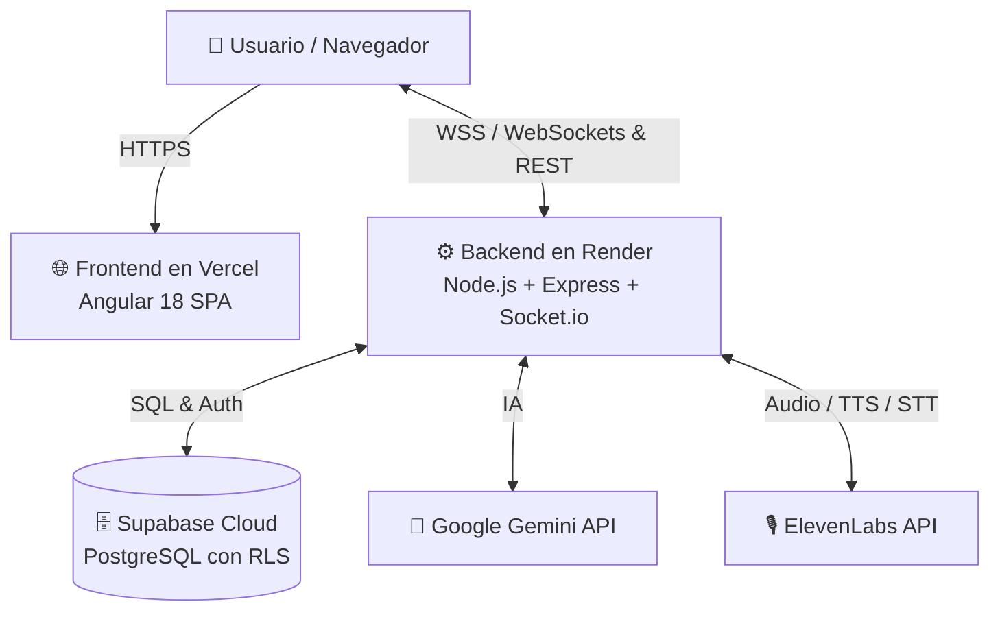

# 🚀 Guía de Despliegue en la Nube (Render + Vercel + Supabase)

Esta guía explica paso a paso cómo desplegar la aplicación completa en producción de manera 100% gratuita o de bajísimo costo, manteniendo soporte completo para **WebSockets en tiempo real**, **Base de Datos Postgres** e **Inteligencia Artificial**.

---

## 🏗️ Resumen de la Arquitectura en Producción



---

## 📌 Paso 1: Subir cambios a tu Repositorio de GitHub

Tu repositorio actual es: `https://github.com/Riki-Avi/Partner.git`

Para confirmar y subir todos los cambios de tu rama:

```bash
git add .
git commit -m "feat: complete voice partner, auth, and cloud deployment configs"
git push origin feature/voice-conversation-management
```

_(O puedes fusionarlo a la rama `main` en GitHub si prefieres que despliegue automáticamente desde `main`)._

---

## 📌 Paso 2: Desplegar el Backend en Render (Node.js + WebSockets)

1. Ingresa a **[Render.com](https://render.com)** e inicia sesión con tu cuenta de GitHub.
2. Haz clic en **New +** y selecciona **Web Service**.
3. Elige tu repositorio `Riki-Avi/Partner`.
4. Render detectará automáticamente el archivo `render.yaml` o puedes configurarlo manualmente con:
   - **Language / Runtime:** `Docker` (usará `./backend/Dockerfile`).
   - **Root Directory:** `./` (o dejar vacío).
   - **Plan:** `Free` (o Starter $7/mo si prefieres cero suspensión por inactividad).
5. En la sección **Environment Variables**, añade las siguientes claves:
   - `PORT`: `3000`
   - `NODE_ENV`: `production`
   - `AUTH_BYPASS`: `false`
   - `SUPABASE_URL`: Tu URL de Supabase (ej. `https://dwqtrhramqxsztpwfjck.supabase.co`)
   - `SUPABASE_ANON_KEY`: Tu clave anónima de Supabase
   - `SUPABASE_SERVICE_KEY`: Tu clave secreta de Supabase (`sb_secret_...`)
   - `GEMINI_API_KEY`: Tu clave de Google AI Studio
   - `GEMINI_MODEL`: `gemini-3.5-flash-lite`
   - `ELEVENLABS_API_KEY`: Tu API Key de ElevenLabs
   - `ELEVENLABS_MODEL_ID`: `eleven_flash_v2_5`
   - `ELEVENLABS_STT_MODEL_ID`: `scribe_v2`
   - `FRONTEND_URL`: La URL que te otorgue Vercel en el Paso 3 (ej. `https://partner-app.vercel.app`)
6. Haz clic en **Create Web Service**.
7. Copia la URL que te asigne Render (ejemplo: `https://voice-chat-backend-xxxx.onrender.com`).

---

## 📌 Paso 3: Desplegar el Frontend en Vercel (Angular SPA)

1. Ingresa a **[Vercel.com](https://vercel.com)** e inicia sesión con tu cuenta de GitHub.
2. Haz clic en **Add New...** > **Project** e importa el repositorio `Riki-Avi/Partner`.
3. En la configuración del proyecto:
   - **Framework Preset:** `Angular`
   - **Root Directory:** Haz clic en _Edit_ y selecciona la carpeta `frontend`.
   - **Build Command:** `npm run build`
   - **Output Directory:** `dist/frontend/browser` (o `dist/frontend`)
4. Actualiza `frontend/src/environments/environment.prod.ts` con la URL de tu backend en Render:
   ```typescript
   export const environment = {
     production: true,
     apiUrl: 'https://tu-backend-en-render.onrender.com/api',
     socketUrl: 'https://tu-backend-en-render.onrender.com',
     supabaseUrl: 'https://dwqtrhramqxsztpwfjck.supabase.co',
     supabaseAnonKey: 'sb_publishable_drtfpSGNlWRki9ykBGhqXg_DQlfR-tf',
     authBypass: false,
   };
   ```
5. Haz clic en **Deploy**.
6. ¡Listo! Vercel te entregará tu dominio de producción seguro con HTTPS (ej. `https://partner-app.vercel.app`).

---

## 📌 Paso 4: Vincular CORS

Vuelve a **Render > Environment Variables** y coloca en `FRONTEND_URL` la URL que te dio Vercel (ej. `https://partner-app.vercel.app`). ¡Esto asegurará que todas las conexiones de WebSockets y peticiones de voz funcionen con total seguridad!
