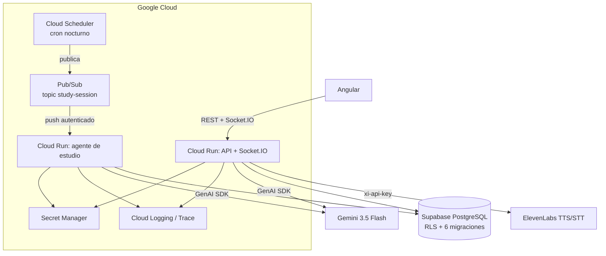

# Planificación · All Things Agentic Hackathon

[English README](./README.md) · [README en español](./README.es.md)

Cierre: **31 ago 2026, 21:00 GMT-3**. Quedan **6 días** desde el 25 de agosto.

Este documento no da por bueno lo que no lo está. Empieza por lo que falta, porque a 6 días del cierre eso es lo único que decide si hay entrega o no.

---

## 1. Estado real frente a los requisitos obligatorios

| Requisito del hackathon                                                                                 | Estado        | Qué falta exactamente                                                                                                                                     |
| ------------------------------------------------------------------------------------------------------- | ------------- | --------------------------------------------------------------------------------------------------------------------------------------------------------- |
| Gemini 3.5 o superior vía Gemini API o Vertex AI                                                        | **Cumple**    | `GEMINI_MODEL=gemini-3.5-flash-lite` sobre `generativelanguage.googleapis.com`. Ver nota en §6 sobre pasar a `gemini-3.5-flash`.                          |
| Al menos un framework de agentes de Google (ADK, GenAI SDK, Antigravity SDK, GenKit)                    | **No cumple** | Se llama a la REST API con el `fetch` nativo de Node. Cero dependencias de Google en `backend/package.json`.                                              |
| Al menos un servicio de infraestructura de Google Cloud (Cloud Run, Cloud SQL, Firestore, GKE, Pub/Sub) | **No cumple** | Hoy: Supabase + dos procesos en local. Nada en GCP.                                                                                                       |
| Prueba de que se construyó y desplegó en Google Cloud                                                   | **No cumple** | No hay despliegue ni proyecto de GCP.                                                                                                                     |
| Agente autónomo que opera **más allá del bucle de chat**, asíncrono o en background                     | **No cumple** | Todo es petición-respuesta. El usuario escribe, el sistema contesta. Es exactamente lo que el hackathon descarta: _"Most AI today waits for you to ask."_ |
| Repo accesible a los jueces                                                                             | **Parcial**   | Hay mucho sin commitear, incluida toda la feature de voz.                                                                                                 |
| Spin-up instructions en el README                                                                       | **Cumple**    | Puesta en marcha + `npm run migrate` reproducible.                                                                                                        |
| Diagrama de arquitectura                                                                                | **Parcial**   | Hay un Mermaid, pero refleja la arquitectura actual, no la que se va a entregar.                                                                          |
| Vídeo demo de ~4 min mostrando el backend en Google Cloud                                               | **No cumple** | —                                                                                                                                                         |
| Write-up (features, tecnologías, aprendizajes)                                                          | **Parcial**   | El README cubre features y tecnologías; falta el texto de envío.                                                                                          |

**Lectura honesta:** el producto está sólido y muy pulido, pero hoy **no es un agente**, y le faltan los dos requisitos técnicos duros (framework de Google y Google Cloud). El trabajo de estos 6 días no es añadir funcionalidad, es cerrar esos huecos.

---

## 2. Track recomendado: The Collaborative Partner

El enunciado pide un agente que _"lleve la iniciativa y tome notas: haga preguntas aclaratorias, guíe al usuario paso a paso, y tenga una forma clara de capturar feedback para adaptarse a su manera de pensar."_

Es el que menos hay que inventar, porque el producto ya hace tres de las cuatro cosas:

- **Guía** al alumno como tutor de inglés.
- **Captura feedback estructurado**: `corrections` con tipo de error, y `phrases` con estado de repaso (`review_count`, `mastered`). Eso no es telemetría genérica, es señal de aprendizaje por usuario.
- **Se adapta**: el material de estudio sale de los errores reales de esa persona, no de un catálogo.

Lo que falta es la iniciativa autónoma. Ver §3.

Los otros dos tracks se descartan por coste, no por gusto:

- **Taskmaster** exigiría un workflow multi-paso ajeno al dominio (mover información entre sistemas externos). Habría que inventar un caso de uso nuevo.
- **Fortified Enterprise Fleet** exige Agent Registry, Agent Identity, Agent Gateway, Model Armor, Memory Bank y Agent Observability. Son seis subsistemas de plataforma. Inviable en 6 días y sin infraestructura corporativa que enchufar.

---

## 3. El hueco conceptual y cómo cerrarlo

### El problema

Hoy: el usuario abre `/chat`, escribe, y Gemini responde. Si el usuario no vuelve, no pasa nada. El sistema espera.

### La propuesta: agente de estudio nocturno

Un agente que se ejecuta **solo, sin que nadie lo pida**, y deja trabajo hecho para cuando el alumno vuelva. Encaja de forma natural con lo que ya se construyó, porque el propio usuario pidió "lo guardo y lo estudio a la noche". El agente es quien prepara esa noche.

Ciclo, disparado por Cloud Scheduler:

1. **Percibir.** Lee las correcciones pendientes y las frases sin traducir de cada usuario activo.
2. **Planificar.** Agrupa los errores por tipo, prioriza por recencia y por número de intentos fallidos, y decide qué merece la pena practicar esta noche y qué ya está dominado.
3. **Actuar, multi-paso.** Traduce las frases pendientes que quedaron sin traducir. Genera ejercicios nuevos a partir de los errores reales de esa persona, no de una plantilla. Redacta un resumen de progreso en inglés sencillo.
4. **Persistir.** Guarda todo como una _sesión de estudio_ lista y esperando.
5. **Rendir cuentas.** Escribe una traza de la ejecución: qué decidió, por qué, qué herramientas usó, cuánto tardó, qué falló.

Esto es autónomo, asíncrono, multi-paso, y opera sobre datos reales del usuario. Y lo más importante para el criterio del 40 %: **elimina fricción real sin que se le pida nada**. El alumno abre la app y la sesión ya está hecha.

### Por qué esto puntúa

El paso 5 no es decorativo. _Architectural Discipline_ (30 %) y _Demo & Production Readiness_ (30 %) premian ver la cadena de razonamiento y que el sistema se pueda auditar. Una tabla `agent_runs` con la traza es lo que convierte "confía en mí, corre solo" en "aquí está lo que hizo anoche a las 3:00".

---

## 4. Arquitectura objetivo

### Decisión: no migrar la base de datos

El requisito pide **al menos un** servicio de infraestructura de Google Cloud. Cloud Run + Cloud Scheduler + Pub/Sub + Secret Manager lo cumplen con holgura.

Migrar Supabase a Cloud SQL a 6 días del cierre es el mayor riesgo con el menor retorno: se perderían las políticas RLS ya escritas, las cinco migraciones aplicadas y verificadas, el runner con checksums, y la autenticación de Supabase Auth. Sería rehacer trabajo probado para satisfacer un requisito que ya está satisfecho por otra vía.

Si un juez pregunta por qué Postgres gestionado fuera de GCP: la respuesta honesta es que la seguridad a nivel de fila y la autenticación ya estaban construidas y verificadas sobre ella, y que el criterio evaluado es la disciplina arquitectónica, no la lealtad a un proveedor.

### Cómo cumplir el requisito de framework

Sustituir las llamadas con `fetch` por el **GenAI SDK de Google para JavaScript** (`@google/genai`). Es la opción de menor riesgo de las cuatro permitidas: es nativa de TypeScript, sustituye código que ya funciona sin cambiar la arquitectura, y `gemini.service.ts` ya está encapsulado detrás de dos métodos (`generateTurn`, `translatePhrase`), así que el cambio queda contenido en un fichero.

ADK sería más vistoso para un jurado, pero es Python/Java: implicaría un servicio aparte en otro lenguaje. Se deja como opción solo si el agente nocturno resulta más limpio en Python, y aun así el SDK de JS ya cubre el requisito.

---

## 5. Riesgos ya identificados en el código

Estos no son hipotéticos, salieron mientras se construía:

1. **`AUTH_BYPASS=true` está activo ahora mismo.** Debe ir a `false` antes de desplegar. Mitigación ya en el código: el backend se niega a arrancar con `NODE_ENV=production`, así que un despliegue olvidadizo falla de forma segura y ruidosa en vez de exponer la cuenta. Verificar de todas formas.
2. **`busyConversations` es un `Set` en memoria.** Cloud Run autoescala; con dos instancias la serialización de turnos se rompe. Hay que fijar `--max-instances=1` **o** mover el lock a Postgres (`pg_advisory_lock` o una fila de estado). Esto es exactamente lo que evalúa _Architectural Discipline_, así que resolverlo bien puntúa; dejarlo roto y que un juez lo vea, resta.
3. **Socket.IO en Cloud Run** necesita afinidad de sesión (`--session-affinity`) y no escala horizontalmente sin un adaptador. Con una instancia no hay problema, pero conviene decirlo en el write-up antes de que lo pregunten.
4. **No hay tests.** Los tres workspaces tienen un `test` de relleno. Con el 30 % en disciplina de ingeniería, conviene al menos cubrir lo crítico: idempotencia de turnos, comprobaciones de propiedad, y el planificador del agente.
5. **La contraseña de base de datos se expuso en un chat.** Rotarla antes de cualquier despliegue.
6. **Hay mucho sin commitear**, incluida toda la feature de voz, que nunca estuvo en Git. Un repo que los jueces no pueden leer completo invalida la entrega.
7. **Sin límites de gasto en GCP.** Presupuesto y alerta antes de encender nada.
8. **Sin `Dockerfile`.** Cloud Run puede construir desde fuente con buildpacks, pero un monorepo con workspaces npm suele necesitar un Dockerfile explícito.

---

## 6. Plan día a día

### Día 1 — 25 ago · Higiene y desbloqueo

- Rotar la contraseña de Supabase y actualizar `SUPABASE_DB_URL`.
- Commitear todo lo pendiente en una rama, revisando que no entre ningún secreto.
- Crear el proyecto de GCP, activar los 150 USD de crédito, y configurar **presupuesto y alerta** antes de nada más.
- Sustituir `fetch` por `@google/genai` en `gemini.service.ts`. **Con esto queda cumplido el requisito de framework de Google.**
- Decidir el track y escribir el pitch en dos frases. Todo lo demás se subordina a ese pitch.

### Día 2 — 26 ago · Estar en Google Cloud

- `Dockerfile` para el backend, respetando los workspaces npm.
- Desplegar el backend en **Cloud Run**. Secretos en **Secret Manager**, no en variables de entorno planas.
- `AUTH_BYPASS=false`, `NODE_ENV=production`, autenticación real. Verificar que el login funciona de punta a punta.
- `--max-instances=1` y `--session-affinity` por lo de Socket.IO, o resolver el lock distribuido si sobra tiempo.
- Desplegar el frontend, con `apiUrl` y `socketUrl` apuntando al dominio `.run.app`. Ajustar `FRONTEND_URL` para CORS.
- **Hito: la app funciona en Google Cloud.** A partir de aquí ya hay algo que enseñar.

### Día 3 — 27 ago · El agente

- Migración `006`: tablas `study_sessions` (el plan que produce el agente) y `agent_runs` (la traza de ejecución).
- Servicio del agente: percibir, planificar, actuar, persistir, según §3.
- Endpoint interno disparable, autenticado, que solo acepta invocaciones de Pub/Sub.
- Probarlo invocándolo a mano antes de automatizarlo.

### Día 4 — 28 ago · Autonomía y visibilidad

- **Cloud Scheduler** → **Pub/Sub** → push a Cloud Run. Que corra de noche sin nadie delante.
- Logs estructurados y traza de la cadena de razonamiento. Si el tiempo llega, OpenTelemetry, que el enunciado menciona explícitamente.
- Pantalla en el frontend que muestre la sesión que el agente preparó solo, con su traza. **Esto es el plano del vídeo que gana el 40 %.**
- Dejarlo corriendo esta noche de verdad, para tener una ejecución real que enseñar mañana.

### Día 5 — 29 ago · Endurecer y documentar

- Tests de lo crítico: idempotencia de turnos, propiedad, planificador del agente.
- Diagrama de arquitectura final, reflejando lo desplegado y no lo planeado.
- Borrador del write-up: features, tecnologías, fuentes de datos, hallazgos y aprendizajes.
- Verificar las spin-up instructions en una carpeta limpia. Si no se reproduce, no cuenta.

### Día 6 — 30 ago · Vídeo

- Grabar los ~4 min: problema, propuesta de valor, demo en vivo, y **prueba de Google Cloud** (consola, dashboard de Cloud Run, logs, URL `.run.app`).
- El vídeo debe mostrar al agente **actuando solo**, no a alguien chateando. La ejecución nocturna del día 4 es el material.
- Sin cortes en la parte de demo. El criterio pide demo en vivo y sin editar.

### Día 7 — 31 ago hasta 21:00 GMT-3 · Margen y envío

- **Enviar por la mañana.** El margen es para imprevistos, no para desarrollar.
- Bonus, solo si el envío ya está hecho: post en LinkedIn o X con `#AllThingsAgenticHackathon`, y un artículo en dev.to o Medium diciendo explícitamente que se escribió para este hackathon.

---

## 7. Mapeo a los criterios de evaluación

| Criterio                              | Peso | Qué lo cubre                                                                                                                                                                                                                                                                                                                      |
| ------------------------------------- | ---- | --------------------------------------------------------------------------------------------------------------------------------------------------------------------------------------------------------------------------------------------------------------------------------------------------------------------------------- |
| Innovation & Operational Utility      | 40 % | El agente nocturno actúa sin que se le pida. Prepara la sesión de estudio a partir de los errores reales del alumno mientras duerme. Elimina la fricción de "tengo que ponerme a organizar qué estudio".                                                                                                                          |
| Architectural Discipline & Tech Stack | 30 % | Desacoplado por Pub/Sub. Estado y memoria en Postgres con RLS. Secretos en Secret Manager. Fallos gestionados: turnos idempotentes por `clientMessageId`, reintento con clasificación de error reintentable, trigger que cierra la carrera comprobación/escritura, y lock de turnos resuelto explícitamente en lugar de ignorado. |
| Demo & Production Readiness           | 30 % | Vídeo en vivo sin cortes, diagrama limpio, setup reproducible con `npm run migrate` y checksums, y prueba visible de Cloud Run y sus logs.                                                                                                                                                                                        |

---

## 8. Qué NO hacer

- **No migrar la base de datos** a Cloud SQL. Máximo riesgo, mínimo retorno, requisito ya cubierto.
- **No intentar el track Fortified Enterprise Fleet.** Son seis subsistemas de plataforma.
- **No añadir features de producto.** El chat, las correcciones, las frases y la voz ya están. Lo que falta es autonomía y despliegue, no funcionalidad. Cada hora en una feature nueva es una hora que no está en el 100 % de la nota.
- **No dejar el bypass de autenticación activo** en nada desplegado.
- **No grabar el vídeo el último día.** Es el entregable que más veces sale mal.

---

## 9. Definición de "entregado"

- [ ] Backend y frontend corriendo en Cloud Run, con prueba en vídeo
- [ ] Gemini 3.5 accedido a través del GenAI SDK de Google
- [ ] Cloud Scheduler + Pub/Sub disparando el agente sin intervención
- [ ] Al menos una ejecución nocturna real, con su traza visible
- [ ] `AUTH_BYPASS=false` y autenticación real funcionando
- [ ] Contraseña de base de datos rotada
- [ ] Repo completo, commiteado y accesible a los jueces
- [ ] README con spin-up instructions verificadas en limpio
- [ ] Diagrama de arquitectura de lo realmente desplegado
- [ ] Vídeo de ~4 min con demo en vivo y prueba de Google Cloud
- [ ] Write-up enviado

---

## Nota sobre el modelo

El enunciado dice _"leveraging Gemini 3.5 Flash"_ y como requisito _"Gemini 3.5 o superior"_. La configuración actual es `gemini-3.5-flash-lite`, que cumple el requisito. Conviene evaluar `gemini-3.5-flash` para el agente: la planificación multi-paso se beneficia de un modelo más capaz que la variante lite, y además coincide literalmente con el texto del enunciado. El chat puede seguir en `lite` por coste, ya que solo hace un turno conversacional. Es un cambio de una variable de entorno, así que se puede decidir midiendo.
