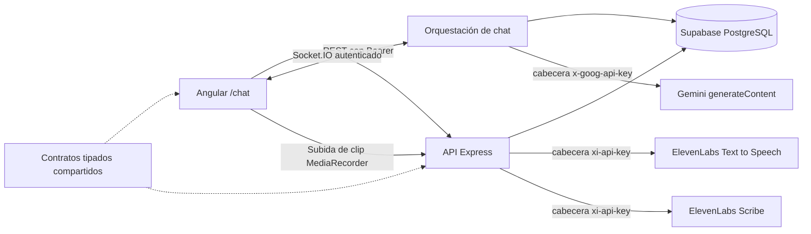

# Voice Chat Foundation

**Español** · [English](./README.md) · [Planificación del hackathon](./PLANIFICACION.md)

Aplicación Angular 18 + Express/TypeScript para practicar inglés. Ofrece conversaciones de texto autenticadas y tituladas con Gemini, dictado y voz natural con ElevenLabs, persistencia en Supabase, entrega en tiempo real por Socket.IO, y dos superficies de estudio: las correcciones que el tutor detecta y un cuaderno de frases propio.

## Requisitos previos

- Node.js 20+ y npm 10+
- Un proyecto de Supabase donde aplicar las migraciones `001` a `005` en orden
- Una clave de API de Google Gemini
- Una clave de API de ElevenLabs con acceso a Text to Speech y Speech to Text
- Chrome, Edge o Firefox recomendados; sirve cualquier navegador con `MediaRecorder`

Todas las versiones de dependencias están fijadas de forma exacta. Gemini y ElevenLabs usan el `fetch` nativo de Node 20; no hace falta ningún SDK de IA ni ningún secreto en el frontend.

## Puesta en marcha

1. Ejecuta `npm install` en la raíz del repositorio.
2. Copia `backend/.env.example` a `backend/.env` y sustituye los placeholders en local.
3. Copia `frontend/src/environments/environment.example.ts` a `frontend/src/environments/environment.ts` y configura solo las URLs públicas de API/socket/Supabase y la anon key.
4. Define `SUPABASE_DB_URL` en `backend/.env` y ejecuta `npm run migrate`, o pega cada fichero de `backend/migrations/` en el editor SQL de Supabase en orden numérico.
5. En una instalación existente, aplica solo las migraciones que falten. De la `002` en adelante añaden sus objetos de forma defensiva y son seguras de reejecutar. La `005` no depende de la `004`, así que el orden entre esas dos es indiferente.
6. Opcionalmente ejecuta `npm run seed`.
7. Ejecuta `npm run dev`, inicia sesión y abre <http://localhost:4200/chat>.

No commitees `.env`. Las claves de Gemini, ElevenLabs y la service-role de Supabase nunca deben copiarse a ficheros del frontend, al código del navegador, a Git, a capturas ni a mensajes de chat. Si una clave se expone, revócala o rótala en la consola de su proveedor y actualiza solo el entorno local del backend.

## Migraciones

`npm run migrate` aplica cada fichero pendiente de `backend/migrations/` en orden numérico, cada uno dentro de su propia transacción, de modo que un fallo deja la base de datos en la última migración completa. Las aplicadas se registran en `public.schema_migrations` junto con un checksum, así que editar una migración ya aplicada se reporta en vez de pasar desapercibido. Añade un fichero nuevo en lugar de editar uno ya aplicado.

Flags útiles, pasados después de `--`:

- `--dry-run` lista lo que haría y no cambia nada.
- `--baseline-through=<fichero>` registra los ficheros hasta `<fichero>` incluido como aplicados **sin** ejecutarlos. Se usa una sola vez al adoptar el runner sobre una base cuyas migraciones se aplicaron a mano: la `001` crea tablas sin `IF NOT EXISTS`, así que reejecutarla contra un esquema vivo falla.

El runner necesita `SUPABASE_DB_URL` (session pooler, puerto 5432; el pooler de transacciones en 6543 no soporta todo el DDL). Fija la CA raíz pública de Supabase desde `backend/certs/` y mantiene la verificación de certificado activa, porque esa conexión lleva credenciales que modifican el esquema y el certificado del pooler de Supabase no está firmado por una CA del almacén del sistema. La aplicación en sí nunca abre esa conexión; habla con Supabase por HTTPS con la service-role key.

## Arquitectura y flujo de chat

1. Angular lista, crea, renombra, termina y borra las conversaciones propias por REST protegido. El historial se carga aparte.
2. Toda mutación de conversación filtra por ID de conversación **y** por ID de usuario autenticado. Por eso un ID inexistente y uno ajeno devuelven la misma respuesta `404` no enumerable.
3. Terminar es idempotente. El backend deriva `duration_seconds` del `started_at` persistido y del reloj del servidor; las conversaciones terminadas conservan el historial pero no pueden recibir mensajes nuevos por socket.
4. `chat:send` lleva solo `conversationId`, el contenido de texto y un `clientMessageId` generado en el navegador.
5. La autenticación del socket es autoritativa: el backend toma `userId` solo de `socket.data`, revalida la propiedad y rechaza conversaciones terminadas antes de persistir el mensaje. Un trigger de base de datos serializa los inserts de mensajes de usuario contra el cierre para cerrar el hueco entre comprobación y escritura concurrentes.
6. Un reintento conserva el mismo client ID. Si su respuesta de asistente ligada ya existe, se emiten las filas persistidas sin llamar a Gemini; si solo existe la fila del usuario, la generación se reanuda y liga la respuesta que faltaba.
7. Un guard de ocupación por conversación serializa los turnos dentro de un proceso de backend. La unicidad en base de datos deduplica reintentos que reutilizan un client ID o un enlace de respuesta, pero no serializa turnos distintos entre réplicas. Ejecuta una sola réplica de backend salvo que ese guard se sustituya por un lock distribuido o una cola.
8. `chat:error` está saneado y correlacionado. La UI deduplica los mensajes persistidos por ID de base de datos.

El cliente de base de datos con service-role omite RLS, así que la propiedad se revalida explícitamente en los métodos de chat. La migración `003` además revoca las escrituras directas de conversaciones y mensajes a los roles del navegador; todas las escrituras de ciclo de vida e historial pasan por el backend autenticado. Los mensajes se ordenan por `timestamp` y luego por `id`.

## Estudiar correcciones y frases

Dos superficies de estudio se alimentan del chat, en `/study` y `/phrases`.

**Las correcciones se detectan, no se adivinan.** El tutor responde con JSON estructurado que contiene su respuesta y los errores encontrados en el último mensaje del alumno, así no hay que extraer nada de la prosa. Dos guardas protegen el material de estudio:

- Se descarta toda corrección cuyo `original` no aparezca literalmente en el mensaje del alumno. Estas filas se convierten en material de estudio, así que un modelo inventándose un error con seguridad es peor que perder uno.
- Una estructura malformada nunca le cuesta al alumno su respuesta. Una salida que no es JSON en absoluto se usa como respuesta sin correcciones, y solo el JSON roto se reintenta.

Las correcciones aparecen bajo el mensaje que describen y en `/study`, que ofrece un listado para hojear y una tarjeta de revelar-y-puntuar para recuerdo activo. Puntuar siempre cuenta un intento de práctica, así que el contador refleja esfuerzo y no solo acierto. Reintentar un turno ya completado reemite las correcciones guardadas en vez de regenerarlas, que es lo que evita que un reintento duplique filas de estudio.

**Las frases** en `/phrases` son el cuaderno propio del alumno: cualquier cosa que merezca decirse en inglés, capturada ahora y estudiada después. Tanto la frase como su nota pueden dictarse en vez de escribirse, reutilizando el mismo camino de grabar-y-transcribir del compositor del chat, y una frase traducida puede reproducirse con **Listen** para practicarla de oído. Guardar queda bloqueado mientras una transcripción está en vuelo, para que nunca se almacene una frase a medio transcribir.

Guardar es deliberadamente la acción más barata de la página, un campo y ninguna llamada al modelo, porque la función existe para los momentos en que no hay tiempo de estudiar. La traducción ocurre a demanda y se cachea en la fila, así que una pulsación repetida no cuesta nada y no puede sobrescribir una traducción que ya se está estudiando. La dirección se detecta en vez de configurarse: una frase que no está en inglés pasa a inglés, y una en inglés da la versión española más una nota de uso.

## Voz en el navegador

- Elige **Mic** para grabar un clip de dictado con `MediaRecorder`. Elige **Stop mic** para terminarlo; el clip se sube entonces al backend autenticado y lo transcribe ElevenLabs Scribe. El transcript rellena el compositor pero nunca se envía automáticamente, así que puede revisarse y editarse antes.
- El botón muestra **Transcribing…** y queda deshabilitado mientras la subida está en vuelo, para que un segundo clic no descarte un transcript que ya viene en camino.
- Los mensajes del asistente exponen controles **Listen** y **Stop**. El backend autenticado genera una voz inglesa natural y consistente con ElevenLabs Text to Speech y devuelve audio MP3 transitorio; no hace falta ningún paquete de voces del sistema operativo.
- **Read replies aloud** se guarda en el `localStorage` del navegador. Aplica solo a mensajes nuevos del asistente recibidos en vivo; cargar o recargar el historial nunca lee mensajes antiguos automáticamente.
- Iniciar la reproducción descarta cualquier grabación abierta para evitar realimentación. Cambiar, terminar o borrar una conversación y salir de la página cancelan grabación, transcripción, generación y reproducción pendientes.
- El dictado no está disponible mientras se espera una respuesta, se transcribe, o se ve una conversación terminada. Las conversaciones terminadas también deshabilitan enviar y reintentar, conservando la reproducción de mensajes.
- El dictado deliberadamente **no** requiere un socket vivo. Graba en local y transcribe por REST, así que un socket caído ya no descarta audio que ya se había hablado. Solo el envío espera la conexión, y el transcript se revisa en el compositor de todas formas.
- **Send permanece deshabilitado mientras se graba.** La secuencia de dictado es **Mic** → hablar → **Stop mic** → esperar el transcript → **Send**. Nada se transcribe hasta pulsar **Stop mic**, porque el grabador entrega su audio solo al detenerse.

Grabar requiere un contexto seguro (`localhost` o HTTPS) y permiso explícito de micrófono. Ambas funciones de voz están mediadas por el servidor, así que se comportan igual en cualquier navegador que soporte `MediaRecorder` y reproducción MP3, y ninguna depende de un proveedor de voz del navegador ni de voces instaladas localmente.

### Privacidad de la voz

**El dictado sube audio.** Al elegir **Stop mic**, el clip grabado se envía al backend autenticado, se reenvía a ElevenLabs Scribe para transcribirlo, y se descarta en cuanto se devuelve el transcript. El audio nunca se escribe en Supabase, nunca se guarda en disco por el backend, y nunca se adjunta a un mensaje; solo persiste el texto que el usuario envía explícitamente. Grabar es siempre explícito: no se captura audio antes de elegir **Mic**, y el micrófono se libera en cuanto el clip termina o se descarta.

Para **Listen** y la lectura automática, el texto de la respuesta del asistente se envía a través del backend autenticado a ElevenLabs Text to Speech; el MP3 generado se devuelve de forma transitoria, se cachea solo en memoria del navegador durante la sesión, y no se guarda en Supabase.

Ambos endpoints de voz requieren un Bearer JWT y están limitados por usuario. La credencial de ElevenLabs se queda en el servidor y nunca se expone al navegador.

## Variables de entorno

### Backend (`backend/.env`)

| Variable               | Propósito                                | Ejemplo                       |
| ---------------------- | ---------------------------------------- | ----------------------------- |
| `PORT`                 | Puerto de Express y Socket.IO            | `3000`                        |
| `NODE_ENV`             | Comportamiento de errores y logs         | `development`                 |
| `FRONTEND_URL`         | Origen CORS permitido exacto             | `http://localhost:4200`       |
| `AUTH_BYPASS`          | Bypass de login en desarrollo; ver abajo | `false`                       |
| `AUTH_BYPASS_EMAIL`    | Perfil que adopta el bypass              | `test@example.com`            |
| `SUPABASE_URL`         | URL del proyecto Supabase                | `https://project.supabase.co` |
| `SUPABASE_ANON_KEY`    | Credencial reservada de ámbito usuario   | anon key de Supabase          |
| `SUPABASE_SERVICE_KEY` | Credencial de base de datos, solo server | service-role key de Supabase  |
| `SUPABASE_DB_URL`      | URI del session pooler, solo migraciones | ver `.env.example`            |
| `GEMINI_API_KEY`       | Credencial de Gemini, solo servidor      | secreto local, nunca frontend |
| `GEMINI_MODEL`         | Modelo usado por `generateContent`       | `gemini-3.5-flash-lite`       |

La voz se configura aparte. Solo `ELEVENLABS_API_KEY` es obligatoria; el resto tiene valores por defecto que funcionan.

| Variable                   | Propósito                                       | Valor por defecto                     |
| -------------------------- | ----------------------------------------------- | ------------------------------------- |
| `ELEVENLABS_API_KEY`       | Credencial de ElevenLabs, solo servidor; obliga | ninguno; la voz devuelve `503`        |
| `ELEVENLABS_VOICE_ID`      | Voz usada en la reproducción                    | primera voz de la cuenta, descubierta |
| `ELEVENLABS_MODEL_ID`      | Modelo de Text to Speech                        | `eleven_flash_v2_5`                   |
| `ELEVENLABS_STT_MODEL_ID`  | Modelo de Speech to Text                        | `scribe_v2`                           |
| `ELEVENLABS_STT_LANGUAGE`  | Pista de idioma para transcribir                | `eng`                                 |
| `ELEVENLABS_OUTPUT_FORMAT` | Formato del audio generado                      | `mp3_44100_128`                       |

Dejar `ELEVENLABS_VOICE_ID` vacío hace que el backend consulte `GET /v1/voices` una vez y cachee la primera voz que encuentre. No se fija un ID de voz por defecto a propósito: ElevenLabs restringe sus voces por defecto heredadas a cuentas creadas antes de marzo de 2026 y las retira por completo el 31 de diciembre de 2026. Fija `ELEVENLABS_VOICE_ID` para elegir la voz deliberadamente y saltarte la consulta.

`ELEVENLABS_OUTPUT_FORMAT` solo acepta formatos que un navegador puede reproducir desde una blob URL (`mp3_*`, `opus_*`, `wav_*`). Los formatos `pcm_*` en crudo y `ulaw_*` de telefonía se rechazan con una advertencia y se sustituyen por el valor por defecto, porque necesitarían añadirles una cabecera de contenedor antes de reproducirse.

### Entorno del frontend

`frontend/src/environments/environment.ts` contiene `apiUrl`, `socketUrl`, `supabaseUrl`, `supabaseAnonKey` y `authBypass`. Intencionadamente no contiene ninguna clave de Gemini, de ElevenLabs ni service-role.

## Bypass de autenticación en desarrollo

Poner `AUTH_BYPASS=true` salta el login por completo: `authMiddleware` y el handshake de Socket.IO dejan de inspeccionar tokens y atribuyen toda petición al perfil indicado por `AUTH_BYPASS_EMAIL`. Pon `authBypass: true` en el entorno del frontend para que coincida, lo que hace que la app adopte ese usuario al arrancar, conecte el socket sin token y oculte los controles de sesión que no tendrían efecto.

El bypass es una comodidad de desarrollo con consecuencias reales, así que está acotado:

- El backend **se niega a arrancar** cuando `AUTH_BYPASS` está activo con `NODE_ENV=production`.
- Al arrancar imprime un banner de advertencia de varias líneas, para que un bypass activo sea imposible de pasar por alto en los logs.
- El flag vale `false` por defecto, y `.env.example` lo trae deshabilitado.
- El código de autenticación no se toca, no se borra. Las comprobaciones de propiedad siguen ejecutándose contra una fila de perfil real, así que conversaciones y mensajes se comportan exactamente igual que con un usuario logueado.

Mientras está activo, cualquiera que alcance el puerto del backend tiene acceso total a esa cuenta. No lo actives en una máquina compartida, detrás de un túnel como ngrok, ni en ningún entorno desplegado. Para restaurar la autenticación real pon `AUTH_BYPASS=false` y `authBypass: false`, y reinicia el backend.

`AUTH_BYPASS_EMAIL` debe coincidir con una fila existente en `public.users`. Ejecuta `npm run seed` para crear el perfil por defecto `test@example.com`; si no, las peticiones fallan con `503 AUTH_BYPASS_MISCONFIGURED` y un mensaje que nombra al usuario que falta.

## API y Socket.IO

Los envelopes REST son `{ success: true, data }` y `{ success: false, error: { code, message } }`.

| Método | Ruta                                          | Propósito                       | Autenticación          |
| ------ | --------------------------------------------- | ------------------------------- | ---------------------- |
| GET    | `/health`                                     | Healthcheck                     | ninguna                |
| POST   | `/api/auth/signup`                            | Crear cuenta                    | ninguna                |
| POST   | `/api/auth/login`                             | Iniciar sesión                  | ninguna                |
| POST   | `/api/auth/logout`                            | Cerrar sesión                   | Bearer JWT             |
| GET    | `/api/auth/me`                                | Usuario actual                  | Bearer JWT             |
| GET    | `/api/conversations`                          | Listar conversaciones           | Bearer JWT             |
| POST   | `/api/conversations`                          | Crear con título opcional       | Bearer JWT             |
| PATCH  | `/api/conversations/:conversationId`          | Renombrar                       | Bearer JWT + propiedad |
| POST   | `/api/conversations/:conversationId/end`      | Terminar y calcular duración    | Bearer JWT + propiedad |
| DELETE | `/api/conversations/:conversationId`          | Borrar conversación e historial | Bearer JWT + propiedad |
| GET    | `/api/conversations/:conversationId/messages` | Cargar historial                | Bearer JWT + propiedad |
| GET    | `/api/corrections`                            | Listar correcciones guardadas   | Bearer JWT             |
| GET    | `/api/corrections/stats`                      | Recuentos por tipo de error     | Bearer JWT             |
| PATCH  | `/api/corrections/:correctionId`              | Registrar práctica o dominio    | Bearer JWT + propiedad |
| GET    | `/api/phrases`                                | Listar frases guardadas         | Bearer JWT             |
| POST   | `/api/phrases`                                | Guardar frase, sin traducir     | Bearer JWT             |
| GET    | `/api/phrases/stats`                          | Recuentos del cuaderno          | Bearer JWT             |
| POST   | `/api/phrases/:phraseId/translate`            | Traducir y cachear una frase    | Bearer JWT + propiedad |
| PATCH  | `/api/phrases/:phraseId`                      | Editar nota, registrar práctica | Bearer JWT + propiedad |
| DELETE | `/api/phrases/:phraseId`                      | Borrar una frase guardada       | Bearer JWT + propiedad |
| POST   | `/api/speech/synthesize`                      | Generar MP3 inglés transitorio  | Bearer JWT             |
| POST   | `/api/speech/transcribe`                      | Transcribir un clip grabado     | Bearer JWT             |

`POST /api/speech/synthesize` recibe `{ text }` y responde con audio binario. `POST /api/speech/transcribe` es el único endpoint que no recibe JSON: el cuerpo de la petición es la grabación en crudo, su `Content-Type` nombra el contenedor (`audio/webm`, `audio/mp4`, `audio/ogg`, `audio/mpeg`, `audio/wav` o `audio/flac`), y la respuesta es el envelope JSON habitual envolviendo `{ text }`. Las subidas se limitan a 10 MB; un clip más grande responde `413 SPEECH_UPLOAD_TOO_LARGE` en vez de un `500` genérico.

Los fallos de voz usan códigos dedicados para que la UI pueda explicarlos: `SPEECH_NOT_CONFIGURED` (`503`) cuando falta la clave de ElevenLabs, `SPEECH_NO_SPEECH_DETECTED` (`422`) para un clip silencioso, `SPEECH_PROVIDER_ERROR` (`502`) ante un fallo o timeout del proveedor, y `SPEECH_RATE_LIMITED` (`429`) pasadas 12 síntesis o 20 transcripciones por usuario y minuto. El detalle del error del proveedor solo se registra en el servidor.

Los eventos de socket conservan `ping`/`pong` y añaden `chat:send`, `chat:message`, `chat:typing`, `chat:corrections` y `chat:error`. Las entradas se validan por UUID y contenido; nunca se aceptan roles, IDs de usuario, marcas de fin ni duraciones enviadas por el cliente. Enviar a una conversación terminada devuelve `CONVERSATION_ENDED`.

## Scripts

| Comando                                   | Propósito                                                          |
| ----------------------------------------- | ------------------------------------------------------------------ |
| `npm run dev`                             | Arranca los servidores de desarrollo de frontend y backend         |
| `npm run build`                           | Compila shared, luego backend, luego frontend                      |
| `npm run lint`                            | Lint de todos los workspaces                                       |
| `npm run format` / `npm run format:check` | Escribe/comprueba el formato con Prettier                          |
| `npm run test`                            | Ejecuta las comprobaciones configuradas (sin suites reales, a día) |
| `npm run migrate`                         | Aplica las migraciones SQL pendientes                              |
| `npm run seed`                            | Siembra el proyecto de Supabase configurado                        |

## Verificación manual

Estas comprobaciones necesitan credenciales reales, permisos del navegador y acceso a red, y no quedan establecidas por validación estática:

1. Aplica las migraciones `001` a `005`; configura credenciales válidas de Gemini y Supabase solo en el backend; arranca la app.
2. Inicia sesión, abre `/chat` y confirma que se selecciona o se crea una conversación con título por defecto.
3. Crea, renombra y cambia de conversación. Termina una y confirma que compositor, reintento y controles de micrófono quedan deshabilitados mientras historial y Listen siguen disponibles.
4. Borra una conversación no seleccionada, luego la seleccionada; confirma que se selecciona una vecina o se crea una nueva por defecto.
5. Envía texto y observa la burbuja de usuario persistida, el indicador de escritura, la respuesta del asistente y el scroll. Recarga y confirma que el historial se restaura sin duplicados ni voz automática.
6. Concede permiso de micrófono, graba un clip, detén, espera el transcript, edítalo y envíalo explícitamente. Confirma que el indicador de grabación del navegador se apaga al terminar el clip. Deniega el permiso y confirma que aparece una guía amable.
7. Usa **Listen**, **Stop** y **Read replies aloud**. Confirma que solo se autoreproducen las respuestas recién recibidas y que cambiar de conversación detiene el audio.
8. Reintenta el mismo `clientMessageId` y confirma que no hay fila duplicada. Interrumpe un turno parcial y confirma que el reintento reanuda su respuesta faltante.
9. Usa el UUID de una conversación de otro usuario contra REST y socket, y confirma que no se revela ningún dato. Intenta un envío por socket a una conversación terminada y confirma `CONVERSATION_ENDED`.
10. Inspecciona los bundles y las peticiones del navegador: no debe aparecer ninguna `GEMINI_API_KEY`, `ELEVENLABS_API_KEY` ni `SUPABASE_SERVICE_KEY`. La única petición con audio de micrófono debe ser el `POST /api/speech/transcribe` autenticado a tu propio backend, enviado tras **Stop mic**; confirma que ninguna petición va directamente a `api.elevenlabs.io` desde el navegador.
11. Arranca el backend sin `ELEVENLABS_API_KEY` y confirma que **Mic** y **Listen** reportan una guía de configuración en vez de fallar en silencio, mientras el chat de texto sigue funcionando.
12. Guarda una frase, tradúcela, vuelve a pulsar Traducir y confirma que devuelve la traducción cacheada sin gastar otra llamada al modelo.

## Resolución de problemas

- **El micrófono está deshabilitado:** sirve por `localhost` o HTTPS para que `MediaRecorder` esté disponible, conecta el socket, espera a que termine cualquier respuesta o transcripción en curso, y selecciona una conversación activa.
- **Permiso de micrófono denegado:** permite el acceso al micrófono para el sitio en los ajustes del navegador, verifica el dispositivo de entrada correcto y reintenta. Algunos navegadores gestionados deshabilitan la captura por política.
- **No se detecta voz:** revisa la entrada seleccionada en el sistema operativo, el estado de silencio del micrófono y el nivel de entrada; habla después de que aparezca el estado Recording y graba al menos un segundo, ya que los clips muy cortos se rechazan antes de subirse.
- **La transcripción o Listen reportan falta de configuración:** define `ELEVENLABS_API_KEY` en el entorno local del backend y reinicia. El chat de texto funciona sin ella; solo la voz devuelve `503`.
- **Listen falla:** verifica que el backend está corriendo y que la clave de ElevenLabs tiene acceso y cuota para `ELEVENLABS_MODEL_ID`. Si la cuenta no tiene una voz usable, define `ELEVENLABS_VOICE_ID` explícitamente. Reinicia tras cambiar valores del entorno del backend.
- **"The ElevenLabs API key cannot list voices":** la clave carece de `voices_read`, así que el descubrimiento automático de voz no está disponible. Define `ELEVENLABS_VOICE_ID` con una voz de tu cuenta, o concede ese permiso a la clave. La síntesis en sí solo necesita acceso de text-to-speech.
- **`402 paid_plan_required` en el log del backend:** los planes gratuitos de ElevenLabs no pueden usar voces compartidas de la biblioteca por API. Elige una voz que pertenezca a tu propia cuenta.
- **La grabación se rechaza por demasiado grande:** los clips se limitan a 10 MB. Graba turnos más cortos; un minuto de audio Opus queda muy por debajo del límite, así que un rechazo suele significar una grabación muy larga.
- **El navegador bloquea la reproducción:** elige **Listen** una vez después de interactuar con la página. La reproducción automática sigue sujeta a la política de autoplay del navegador.
- **Gemini no está configurado:** define `GEMINI_API_KEY` solo en el entorno local del backend y reinicia.
- **Demasiadas peticiones de voz:** los límites por usuario son 12 síntesis y 20 transcripciones por minuto. Espera a que se reinicie la ventana.
- **Fallo de generación de Gemini:** verifica permisos de la clave, disponibilidad del modelo y `GEMINI_MODEL`; los errores públicos ocultan a propósito los detalles del proveedor.
- **401 / token expirado:** limpia `voice_chat_token` y vuelve a iniciar sesión.
- **Sigue apareciendo la pantalla de login con el bypass activo:** `authBypass` en el entorno del frontend debe coincidir con `AUTH_BYPASS` en el backend. El backend además necesita un reinicio, porque nodemon solo vigila `src/**/*.ts` y no recarga `.env`.
- **`AUTH_BYPASS_MISCONFIGURED`:** el perfil indicado por `AUTH_BYPASS_EMAIL` no existe. Ejecuta `npm run seed` o apunta la variable a un usuario existente.
- **Fallo de CORS o socket:** asegúrate de que `FRONTEND_URL` coincide exactamente con el origen del navegador y que las URLs de API y socket del frontend apuntan al backend.
- **Falta una relación o columna:** aplica las migraciones `001` a `005` en orden. Los proyectos existentes solo necesitan las que falten. Si falta `corrections.user_id`, la `004` está pendiente; si falta la relación `phrases`, la `005` está pendiente.
- **Las correcciones no aparecen nunca:** solo se producen cuando el tutor encuentra realmente un error, y una corrección cuyo texto no aparece literalmente en tu mensaje se descarta por diseño. Revisa el log del backend por una advertencia de corrección descartada.
- **Una columna no existe justo tras una migración:** Supabase cachea el esquema para su Data API. Repite la petición; si persiste, recarga el esquema de la API del proyecto desde el dashboard.
- **El turno se detuvo tras el mensaje del usuario:** reintenta la burbuja fallida para que reutilice su `clientMessageId` existente.
- **La conversación es de solo lectura:** ha terminado por diseño. Crea una nueva para continuar; el estado terminado es irreversible.
- **Puerto ocupado:** detén el proceso que lo ocupa o actualiza las URLs de backend y frontend a la vez.
