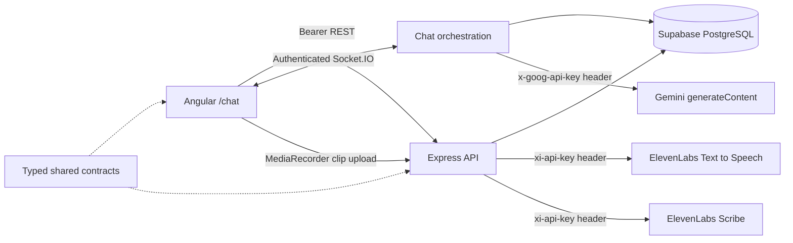

# Voice Chat Foundation

**English** · [Español](./README.es.md) · [Hackathon plan](./PLANIFICACION.md)

Angular 18 + Express/TypeScript application for English practice. It provides authenticated, titled text conversations with Gemini, ElevenLabs dictation and natural English speech, Supabase persistence, real-time delivery through Socket.IO, and two study surfaces: the corrections the tutor detects, and the learner's own phrase notebook.

## Prerequisites

- Node.js 20+ and npm 10+
- A Supabase project where migrations `001` through `005` can be applied in order
- A Google Gemini API key
- An ElevenLabs API key with Text to Speech and Speech to Text access
- Chrome, Edge, or Firefox recommended; any browser with `MediaRecorder` support works

All dependency versions are exact. Gemini and ElevenLabs both use Node 20 native `fetch`; no AI SDK or frontend secret is required.

## Quick start

1. Run `npm install` in the repository root.
2. Copy `backend/.env.example` to `backend/.env` and replace the placeholders locally.
3. Copy `frontend/src/environments/environment.example.ts` to `frontend/src/environments/environment.ts` and configure only the API/socket/Supabase public URLs and anon key.
4. Set `SUPABASE_DB_URL` in `backend/.env` and run `npm run migrate`, or paste each file in
   `backend/migrations/` into the Supabase SQL editor in numbered order.
5. For an existing installation, apply only the migrations not already applied. Migrations `002`
   onwards add their objects defensively and are safe to rerun. `005` does not depend on `004`, so
   the order between those two does not matter.
6. Optionally run `npm run seed`.
7. Run `npm run dev`, sign in, and open <http://localhost:4200/chat>.

Do not commit `.env`. Gemini, ElevenLabs, and Supabase service-role keys must never be copied into frontend files, browser code, Git, screenshots, or chat messages. If a key has been exposed, revoke or rotate it in its provider console and update only the local backend environment.

## Migrations

`npm run migrate` applies every pending file in `backend/migrations/` in numbered order, each inside
its own transaction so a failure leaves the database on the last complete migration. Applied files
are recorded in `public.schema_migrations` along with a checksum, so editing a migration that already
ran is reported rather than silently ignored. Add a new file instead of editing an applied one.

Useful flags, passed after `--`:

- `--dry-run` lists what would happen and changes nothing.
- `--baseline-through=<file>` records files up to and including `<file>` as applied **without**
  running them. Use it once when adopting the runner on a database whose migrations were applied by
  hand: `001` creates tables without `IF NOT EXISTS`, so replaying it against a live schema fails.

The runner needs `SUPABASE_DB_URL` (session pooler, port 5432 — the transaction pooler on 6543 does
not handle all DDL). It pins Supabase's public root CA from `backend/certs/` and keeps certificate
verification on, because that connection carries schema-changing credentials and Supabase's pooler
certificate is not signed by a CA in the system trust store. The application itself never opens this
connection; it talks to Supabase over HTTPS with the service-role key.

## Architecture and chat flow

1. Angular lists, creates, renames, ends, and deletes owned conversations over protected REST. It loads persisted history separately.
2. Every conversation mutation filters by both conversation ID and authenticated user ID. Missing and foreign IDs therefore return the same non-enumerable `404` response.
3. Ending is idempotent. The backend derives `duration_seconds` from persisted `started_at` and server time; ended conversations retain history but cannot receive new socket messages.
4. `chat:send` carries only `conversationId`, text content, and a browser-generated `clientMessageId`.
5. Socket authentication is authoritative: the backend takes `userId` only from `socket.data`, revalidates ownership, and rejects ended conversations before message persistence. A database trigger serializes user-message inserts against End to close the concurrent check/write gap.
6. A retry keeps the same client ID. If its linked assistant response exists, the persisted rows are emitted without calling Gemini; if only the user row exists, generation resumes and links the missing response.
7. A local per-conversation busy guard serializes turns within one backend process. Database uniqueness deduplicates retries that reuse a client ID or response link, but it does not serialize different turns across replicas. Run one backend replica unless this guard is replaced with a distributed lock or queue.
8. `chat:error` is sanitized and correlated. The UI deduplicates persisted messages by database ID.

The service-role database client bypasses RLS, so ownership is explicitly revalidated in chat database methods. Migration `003` also revokes direct conversation/message writes from browser roles; all lifecycle and history writes go through the authenticated backend. Messages are ordered by `timestamp`, then `id`. Migration `002` adds role-constrained idempotency/link columns; migration `003` adds the backfilled, non-empty conversation title with a 120-character limit. Neither modifies previously applied migration files.

## Studying corrections and phrases

Two study surfaces feed off the chat, both at `/study` and `/phrases`.

**Corrections** are detected, not guessed. The tutor answers with structured JSON containing its
reply and the mistakes it found in the learner's most recent message, so nothing has to be parsed
back out of prose. Two guards protect the study material:

- A correction whose `original` does not appear verbatim in the learner's message is discarded. These
  rows become study material, so a confident model inventing a mistake is worse than losing one.
- Malformed structure never costs the learner their reply. Output that is not JSON at all is used as
  the reply with no corrections, and only broken JSON is retried.

Corrections appear under the message they describe and in `/study`, which offers a browsing list and
a reveal-then-grade card for active recall. Grading always counts a practice attempt, so the counter
reflects effort rather than only success. Retrying a completed turn replays the stored corrections
instead of regenerating them, which is what keeps a retry from duplicating study rows.

**Phrases** at `/phrases` are the learner's own notebook: anything worth saying in English, captured
now and studied later. Both the phrase and its note can be dictated instead of typed, reusing the
same record-and-transcribe path as the chat composer, and a translated phrase can be played back
with **Listen** to practise it by ear. Saving is blocked while a dictation is still in flight so a
phrase is never stored half-transcribed. Saving is deliberately the cheapest action on the page, one field and no model
call, because the feature exists for moments when there is no time to study. Translation happens on
demand and is cached on the row, so a repeated tap costs nothing and cannot overwrite a translation
already being studied. Direction is detected rather than configured: a non-English phrase becomes
English, and an English phrase becomes Spanish plus a usage note.

## Browser voice features

- Select **Mic** to record one dictation clip with `MediaRecorder`. Select **Stop mic** to finish it; the clip is then uploaded to the authenticated backend and transcribed by ElevenLabs Scribe. The transcript fills the composer but is never sent automatically, so it can be reviewed and edited first.
- The button reads **Transcribing…** and is disabled while the upload is in flight, so a second click cannot discard a transcript that is already on its way.
- Assistant messages expose **Listen** and **Stop** controls. The authenticated backend generates a consistent, natural English voice with ElevenLabs Text to Speech and returns transient MP3 audio; users do not need an operating-system voice pack.
- **Read replies aloud** is stored in browser `localStorage`. It applies only to new assistant messages received live; loading or reloading history never reads old messages automatically.
- Starting playback discards any open recording to avoid feedback. Switching, ending, or deleting a conversation and leaving the page cancel pending recording, transcription, generation, and playback.
- Dictation is unavailable while waiting for a reply, transcribing, or viewing an ended conversation. Ended conversations also disable sending and retry while preserving message playback.
- Dictation deliberately does **not** require a live socket. It records locally and transcribes over REST, so a dropped socket no longer discards audio that was already spoken. Only sending waits for the connection, and the transcript is reviewed in the composer first either way.
- **Send stays disabled while recording.** The dictation sequence is **Mic** → speak → **Stop mic** → wait for the transcript → **Send**. Nothing is transcribed until **Stop mic** is selected, because the recorder emits its audio only when it stops.

Recording requires a secure context (`localhost` or HTTPS) and explicit microphone permission. Both voice features are server-mediated, so they behave the same across browsers that support `MediaRecorder` and MP3 playback, and neither depends on a browser speech provider or locally installed voices.

### Voice privacy

Dictation uploads audio. When **Stop mic** is selected, the recorded clip is sent to the authenticated backend, forwarded to ElevenLabs Scribe for transcription, and discarded once the transcript is returned. The audio is never written to Supabase, never stored on disk by the backend, and never attached to a message; only text explicitly sent by the user is persisted. Recording is always explicit: no audio is captured before **Mic** is selected, and the microphone is released as soon as the clip is finished or discarded.

For **Listen** and automatic read-aloud, the assistant response text is sent through the authenticated backend to ElevenLabs Text to Speech; the generated MP3 is returned transiently, cached only in browser memory for the session, and is not stored in Supabase.

Both voice endpoints require a Bearer JWT and are rate limited per user. The ElevenLabs credential stays server-side and is never exposed to the browser.

## Environment variables

### Backend (`backend/.env`)

| Variable               | Purpose                                | Example                          |
| ---------------------- | -------------------------------------- | -------------------------------- |
| `PORT`                 | Express and Socket.IO port             | `3000`                           |
| `NODE_ENV`             | Error/log behavior                     | `development`                    |
| `FRONTEND_URL`         | Exact allowed CORS origin              | `http://localhost:4200`          |
| `AUTH_BYPASS`          | Development login bypass; see below    | `false`                          |
| `AUTH_BYPASS_EMAIL`    | Profile the bypass acts as             | `test@example.com`               |
| `SUPABASE_URL`         | Supabase project URL                   | `https://project.supabase.co`    |
| `SUPABASE_ANON_KEY`    | Reserved user-scoped credential        | Supabase anon key                |
| `SUPABASE_SERVICE_KEY` | Server-only database credential        | Supabase service-role key        |
| `SUPABASE_DB_URL`      | Session pooler URI, migrations only    | see `.env.example`               |
| `GEMINI_API_KEY`       | Server-only Gemini credential          | local secret, never frontend/Git |
| `GEMINI_MODEL`         | Gemini model used by `generateContent` | `gemini-3.5-flash-lite`          |

Voice is configured separately. Only `ELEVENLABS_API_KEY` is required; the rest have working defaults.

| Variable                   | Purpose                                     | Default                                |
| -------------------------- | ------------------------------------------- | -------------------------------------- |
| `ELEVENLABS_API_KEY`       | Server-only ElevenLabs credential; required | none; voice features return `503`      |
| `ELEVENLABS_VOICE_ID`      | Voice used for playback                     | first voice on the account, discovered |
| `ELEVENLABS_MODEL_ID`      | Text to Speech model                        | `eleven_flash_v2_5`                    |
| `ELEVENLABS_STT_MODEL_ID`  | Speech to Text model                        | `scribe_v2`                            |
| `ELEVENLABS_STT_LANGUAGE`  | Transcription language hint                 | `eng`                                  |
| `ELEVENLABS_OUTPUT_FORMAT` | Generated audio format                      | `mp3_44100_128`                        |

`GEMINI_MODEL` defaults to `gemini-3.5-flash-lite` and is validated on first use. Never put a Gemini, ElevenLabs, or service-role key in Angular's environment.

Leaving `ELEVENLABS_VOICE_ID` empty makes the backend query `GET /v1/voices` once and cache the first voice it finds. A shared default voice identifier is deliberately not hardcoded: ElevenLabs restricts its legacy default voices to accounts created before March 2026 and retires them entirely on December 31, 2026. Pin `ELEVENLABS_VOICE_ID` to choose the voice deliberately and skip the lookup.

`ELEVENLABS_OUTPUT_FORMAT` accepts only formats a browser can play from a blob URL (`mp3_*`, `opus_*`, `wav_*`). Raw `pcm_*` and telephony `ulaw_*` formats are rejected with a warning and replaced by the default, because they would need a container header added before playback.

### Frontend environment

`frontend/src/environments/environment.ts` contains `apiUrl`, `socketUrl`, `supabaseUrl`, `supabaseAnonKey`, and `authBypass`. It intentionally contains no Gemini key, ElevenLabs key, or service-role key.

## Development authentication bypass

Setting `AUTH_BYPASS=true` skips login entirely: `authMiddleware` and the Socket.IO handshake stop inspecting tokens and attribute every request to the profile named by `AUTH_BYPASS_EMAIL`. Set `authBypass: true` in the frontend environment to match, which makes the app adopt that user at startup, connect the socket without a token, and hide the session controls that would have no effect.

The bypass is a development affordance with real consequences, so it is fenced in:

- The backend **refuses to start** when `AUTH_BYPASS` is enabled while `NODE_ENV=production`.
- Startup prints a multi-line warning banner so an enabled bypass is impossible to miss in logs.
- The flag defaults to `false`, and `.env.example` ships it disabled.
- Authentication code is untouched, not deleted. Ownership checks still run against a real profile row, so conversations and messages behave exactly as they do with a signed-in user.

While it is on, anyone who can reach the backend port has full access to that account. Do not enable it on a shared machine, behind a tunnel such as ngrok, or on any deployed environment. To restore real authentication set `AUTH_BYPASS=false` and `authBypass: false`, then restart the backend.

`AUTH_BYPASS_EMAIL` must match an existing row in `public.users`. Run `npm run seed` to create the default `test@example.com` profile; otherwise requests fail with `503 AUTH_BYPASS_MISCONFIGURED` and a message naming the missing user.

## API and Socket.IO

REST envelopes are `{ success: true, data }` and `{ success: false, error: { code, message } }`.

| Method | Route                                         | Purpose                         | Authentication         |
| ------ | --------------------------------------------- | ------------------------------- | ---------------------- |
| GET    | `/health`                                     | Health check                    | None                   |
| POST   | `/api/auth/signup`                            | Create account                  | None                   |
| POST   | `/api/auth/login`                             | Sign in                         | None                   |
| POST   | `/api/auth/logout`                            | Sign out                        | Bearer JWT             |
| GET    | `/api/auth/me`                                | Current user                    | Bearer JWT             |
| GET    | `/api/conversations`                          | List conversations              | Bearer JWT             |
| POST   | `/api/conversations`                          | Create with optional title      | Bearer JWT             |
| PATCH  | `/api/conversations/:conversationId`          | Rename                          | Bearer JWT + ownership |
| POST   | `/api/conversations/:conversationId/end`      | End and calculate duration      | Bearer JWT + ownership |
| DELETE | `/api/conversations/:conversationId`          | Delete conversation and history | Bearer JWT + ownership |
| GET    | `/api/conversations/:conversationId/messages` | Load history                    | Bearer JWT + ownership |
| GET    | `/api/corrections`                            | List saved corrections          | Bearer JWT             |
| GET    | `/api/corrections/stats`                      | Correction counts by type       | Bearer JWT             |
| PATCH  | `/api/corrections/:correctionId`              | Record practice or mastery      | Bearer JWT + ownership |
| GET    | `/api/phrases`                                | List saved phrases              | Bearer JWT             |
| POST   | `/api/phrases`                                | Save a phrase, no translation   | Bearer JWT             |
| GET    | `/api/phrases/stats`                          | Phrase notebook counts          | Bearer JWT             |
| POST   | `/api/phrases/:phraseId/translate`            | Translate and cache a phrase    | Bearer JWT + ownership |
| PATCH  | `/api/phrases/:phraseId`                      | Edit note, record practice      | Bearer JWT + ownership |
| DELETE | `/api/phrases/:phraseId`                      | Delete a saved phrase           | Bearer JWT + ownership |
| POST   | `/api/speech/synthesize`                      | Generate transient English MP3  | Bearer JWT             |
| POST   | `/api/speech/transcribe`                      | Transcribe a recorded clip      | Bearer JWT             |

`POST /api/speech/synthesize` takes `{ text }` and answers with binary audio. `POST /api/speech/transcribe` is the one endpoint that does not take JSON: the request body is the raw recording, its `Content-Type` names the container (`audio/webm`, `audio/mp4`, `audio/ogg`, `audio/mpeg`, `audio/wav`, or `audio/flac`), and the response is the usual JSON envelope wrapping `{ text }`. Uploads are capped at 10 MB; a larger clip answers `413 SPEECH_UPLOAD_TOO_LARGE` rather than a generic `500`.

Voice failures use dedicated codes so the UI can explain them: `SPEECH_NOT_CONFIGURED` (`503`) when the ElevenLabs key is missing, `SPEECH_NO_SPEECH_DETECTED` (`422`) for a silent clip, `SPEECH_PROVIDER_ERROR` (`502`) for a provider failure or timeout, and `SPEECH_RATE_LIMITED` (`429`) past 12 synthesis or 20 transcription requests per user per minute. Provider error detail is logged server-side only.

Socket events retain `ping`/`pong` and add `chat:send`, `chat:message`, `chat:typing`, `chat:corrections`, and `chat:error`. Inputs are UUID/content validated; client-supplied roles, user IDs, end timestamps, and durations are never accepted. Sending to an ended conversation returns `CONVERSATION_ENDED`.

## Scripts

| Command                                   | Purpose                                                                        |
| ----------------------------------------- | ------------------------------------------------------------------------------ |
| `npm run dev`                             | Start frontend/backend development servers                                     |
| `npm run build`                           | Build shared, backend, then frontend                                           |
| `npm run lint`                            | Lint all workspaces                                                            |
| `npm run format` / `npm run format:check` | Write/check Prettier formatting                                                |
| `npm run test`                            | Run configured workspace checks (optional suites remain intentionally omitted) |
| `npm run migrate`                         | Apply pending SQL migrations (see below)                                       |
| `npm run seed`                            | Seed the configured Supabase project                                           |

## Manual verification

These checks need real credentials, browser permissions, and network access and are not established by static validation:

1. Apply migrations `001` through `005`; configure valid backend-only Gemini and Supabase credentials; start the app.
2. Sign in, open `/chat`, and confirm a default-titled conversation is selected or created.
3. Create, rename, and switch conversations. End one and confirm composer, retry, and microphone controls are disabled while history and Listen remain available.
4. Delete an unselected conversation, then delete the selected one; confirm a neighboring conversation is selected or a new default conversation is created.
5. Send text and observe the persisted user bubble, typing indicator, assistant reply, and scroll behavior. Reload and confirm history is restored without duplicates or automatic speech.
6. Grant microphone permission, record a clip, stop, wait for the transcript, edit it, and explicitly send it. Confirm the browser's recording indicator clears when the clip finishes. Deny permission and confirm friendly guidance appears.
7. Use **Listen**, **Stop**, and **Read replies aloud**. Confirm only newly received replies auto-play and switching conversations stops audio.
8. Retry the same `clientMessageId` and confirm no duplicate row. Interrupt a partial turn and confirm retry resumes its missing response.
9. Use a second user's conversation UUID against REST/socket and confirm no data is disclosed. Attempt a socket send to an ended conversation and confirm `CONVERSATION_ENDED`.
10. Inspect browser bundles and requests: no `GEMINI_API_KEY`, `ELEVENLABS_API_KEY`, or `SUPABASE_SERVICE_KEY` may appear. The only microphone audio request must be the authenticated `POST /api/speech/transcribe` to your own backend, sent after **Stop mic**; confirm no request goes directly to `api.elevenlabs.io` from the browser.
11. Start the backend without `ELEVENLABS_API_KEY` and confirm **Mic** and **Listen** report configuration guidance instead of failing silently, while text chat keeps working.
12. Save a phrase, translate it, then press Translate again and confirm the cached translation is returned without spending another model call.

## Troubleshooting

- **Mic is disabled:** serve over `localhost` or HTTPS so `MediaRecorder` is available, connect the socket, wait for any current reply or transcription to finish, and select an active conversation.
- **Microphone permission denied:** allow microphone access for the site in browser settings, verify the correct input device, then retry. Some managed browsers disable capture by policy.
- **No speech detected:** check the selected operating-system input, microphone mute state, and input level; speak after the Recording status appears and record for at least a second, since very short clips are rejected before upload.
- **Transcription or Listen reports missing configuration:** set `ELEVENLABS_API_KEY` in the local backend environment and restart. Text chat works without it; only the voice features return `503`.
- **Listen fails:** verify the backend is running and that the ElevenLabs key has access and quota for `ELEVENLABS_MODEL_ID`. If the account has no usable voice, set `ELEVENLABS_VOICE_ID` explicitly. Restart after changing backend environment values. No operating-system voice installation is required.
- **"The ElevenLabs API key cannot list voices":** the key lacks `voices_read`, so automatic voice discovery is unavailable. Set `ELEVENLABS_VOICE_ID` to a voice from your account, or grant the key that permission. Synthesis itself only needs text-to-speech access.
- **`402 paid_plan_required` in the backend log:** free ElevenLabs plans cannot use shared library voices through the API. Pick a voice that belongs to your own account.
- **Recording is rejected as too large:** clips are capped at 10 MB. Record shorter turns; a minute of Opus audio is far below the limit, so a rejection usually means a very long recording.
- **Browser blocks playback:** select **Listen** once after interacting with the page. Automatic playback remains subject to browser autoplay policy.
- **Gemini is not configured:** set `GEMINI_API_KEY` only in the local backend environment and restart.
- **Too many voice requests:** the per-user limits are 12 synthesis and 20 transcription requests per minute. Wait for the window to reset.
- **Gemini generation failure:** verify key permissions/model availability and `GEMINI_MODEL`; public errors intentionally hide provider details.
- **401/expired token:** clear `voice_chat_token`, then sign in again.
- **Login screen still appears with the bypass on:** `authBypass` in the frontend environment must match `AUTH_BYPASS` in the backend. The backend also needs a restart, because nodemon only watches `src/**/*.ts` and will not reload `.env`.
- **`AUTH_BYPASS_MISCONFIGURED`:** the profile named by `AUTH_BYPASS_EMAIL` does not exist. Run `npm run seed` or point the variable at an existing user.
- **CORS/socket failure:** ensure `FRONTEND_URL` exactly matches the browser origin and frontend API/socket URLs target the backend.
- **Missing relation/column:** apply migrations `001` through `005` in order. Existing projects only need migrations not already applied. A missing `corrections.user_id` means `004` is pending; a missing `phrases` relation means `005` is pending.
- **Corrections never appear:** they are only produced when the tutor actually finds a mistake, and a correction whose text does not appear verbatim in your message is discarded by design. Check the backend log for a discarded-correction warning.
- **Column does not exist right after a migration:** Supabase caches the schema for its Data API. Re-run the request; if it persists, reload the project's API schema from the dashboard.
- **Turn stopped after the user message:** retry the failed bubble so its existing `clientMessageId` is reused.
- **Conversation is read-only:** it has ended by design. Create a new conversation to continue; ended state is irreversible.
- **Port in use:** stop the occupying process or update backend and frontend URLs together.
