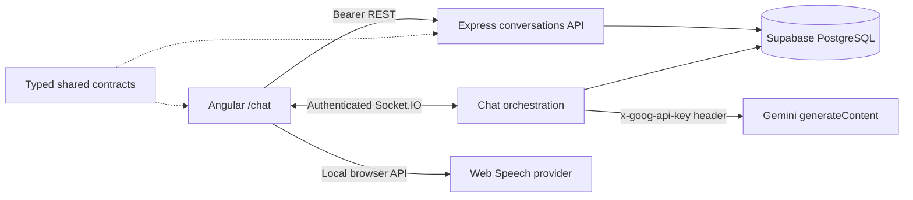

# Voice Chat Foundation

Angular 18 + Express/TypeScript application for English practice. It provides authenticated, titled text conversations with Gemini, browser speech recognition and text-to-speech, Supabase persistence, and real-time delivery through Socket.IO.

## Prerequisites

- Node.js 20+ and npm 10+
- A Supabase project where migrations `001`, `002`, and `003` can be applied in order
- A Google Gemini API key
- Chrome or Edge recommended for the complete Web Speech experience

All dependency versions are exact. Gemini uses Node 20 native `fetch`; no AI SDK or frontend secret is required.

## Quick start

1. Run `npm install` in the repository root.
2. Copy `backend/.env.example` to `backend/.env` and replace the placeholders locally.
3. Copy `frontend/src/environments/environment.example.ts` to `frontend/src/environments/environment.ts` and configure only the API/socket/Supabase public URLs and anon key.
4. Apply these migrations in order:
   1. `backend/migrations/001_initial_schema.sql`
   2. `backend/migrations/002_chat_turn_idempotency.sql`
   3. `backend/migrations/003_conversation_management.sql`
5. For an existing installation, apply only the migrations not already applied. Migrations `002` and `003` add their objects defensively and are safe to rerun.
6. Optionally run `npm run seed`.
7. Run `npm run dev`, sign in, and open <http://localhost:4200/chat>.

Do not commit `.env`. Gemini and Supabase service-role keys must never be copied into frontend files, browser code, Git, screenshots, or chat messages. If a key has been exposed, revoke or rotate it in its provider console and update only the local backend environment.

## Architecture and chat flow

1. Angular lists, creates, renames, ends, and deletes owned conversations over protected REST. It loads persisted history separately.
2. Every conversation mutation filters by both conversation ID and authenticated user ID. Missing and foreign IDs therefore return the same non-enumerable `404` response.
3. Ending is idempotent. The backend derives `duration_seconds` from persisted `started_at` and server time; ended conversations retain history but cannot receive new socket messages.
4. `chat:send` carries only `conversationId`, text content, and a browser-generated `clientMessageId`.
5. Socket authentication is authoritative: the backend takes `userId` only from `socket.data`, revalidates ownership, and rejects ended conversations before message persistence. A database trigger serializes user-message inserts against End to close the concurrent check/write gap.
6. A retry keeps the same client ID. If its linked assistant response exists, the persisted rows are emitted without calling Gemini; if only the user row exists, generation resumes and links the missing response.
7. A local per-conversation busy guard serializes turns within one backend process. Database uniqueness deduplicates retries that reuse a client ID or response link, but it does not serialize different turns across replicas. Run one backend replica unless this guard is replaced with a distributed lock or queue.
8. `chat:error` is sanitized and correlated. The UI deduplicates persisted messages by database ID.

The service-role database client bypasses RLS, so ownership is explicitly revalidated in chat database methods. Migration `003` also revokes direct conversation/message writes from browser roles; all lifecycle and history writes go through the authenticated backend. Messages are ordered by `timestamp`, then `id`. Migration `002` adds role-constrained idempotency/link columns; migration `003` adds the backfilled, non-empty conversation title with a 120-character limit. Neither modifies previously applied migration files.

## Browser voice features

- Select **Mic** to start one English (`en-US`) dictation session. Select **Stop mic** to finish it. The final transcript fills the composer but is never sent automatically, so it can be reviewed and edited first.
- Assistant messages expose **Listen** and **Stop** controls. The browser chooses an available English voice and falls back to its default voice.
- **Read replies aloud** is stored in browser `localStorage`. It applies only to new assistant messages received live; loading or reloading history never reads old messages automatically.
- Starting playback stops microphone recognition to avoid feedback. Switching, ending, or deleting a conversation and leaving the page stop both recognition and playback.
- Dictation is unavailable while disconnected, waiting for a reply, or viewing an ended conversation. Ended conversations also disable sending and retry while preserving message playback.

Chrome or Edge on `localhost` or an HTTPS origin is recommended. Speech recognition usually requires a secure context and explicit microphone permission. Browser and operating-system voice availability varies; unsupported controls are visibly disabled with a hint.

### Voice privacy

The application does not record, persist, or upload microphone audio itself. Audio is handled by the browser's Web Speech implementation and may be processed by the browser vendor's configured speech provider under that vendor's privacy terms. Only the final text that the user explicitly sends is persisted by this application. Text-to-speech is also requested directly from the browser and creates no application audio record.

## Environment variables

### Backend (`backend/.env`)

| Variable               | Purpose                                | Example                          |
| ---------------------- | -------------------------------------- | -------------------------------- |
| `PORT`                 | Express and Socket.IO port             | `3000`                           |
| `NODE_ENV`             | Error/log behavior                     | `development`                    |
| `FRONTEND_URL`         | Exact allowed CORS origin              | `http://localhost:4200`          |
| `SUPABASE_URL`         | Supabase project URL                   | `https://project.supabase.co`    |
| `SUPABASE_ANON_KEY`    | Reserved user-scoped credential        | Supabase anon key                |
| `SUPABASE_SERVICE_KEY` | Server-only database credential        | Supabase service-role key        |
| `GEMINI_API_KEY`       | Server-only Gemini credential          | local secret, never frontend/Git |
| `GEMINI_MODEL`         | Gemini model used by `generateContent` | `gemini-3.5-flash-lite`          |

`GEMINI_MODEL` defaults to `gemini-3.5-flash-lite`. Configuration is validated on the first chat turn, not at server startup. Never put either server key in Angular's environment.

### Frontend environment

`frontend/src/environments/environment.ts` contains `apiUrl`, `socketUrl`, `supabaseUrl`, and `supabaseAnonKey`. It intentionally contains no Gemini key or service-role key.

## API and Socket.IO

REST envelopes are `{ success: true, data }` and `{ success: false, error: { code, message } }`.

| Method | Route                                         | Purpose                         | Authentication         |
| ------ | --------------------------------------------- | ------------------------------- | ---------------------- |
| GET    | `/health`                                     | Health check                    | None                   |
| POST   | `/api/auth/signup`                            | Create account                  | None                   |
| POST   | `/api/auth/login`                             | Sign in                         | None                   |
| POST   | `/api/auth/logout`                            | Sign out                        | Bearer JWT             |
| GET    | `/api/auth/me`                                | Current user                    | Bearer JWT             |
| GET    | `/api/conversations`                          | List conversations              | Bearer JWT             |
| POST   | `/api/conversations`                          | Create with optional title      | Bearer JWT             |
| PATCH  | `/api/conversations/:conversationId`          | Rename                          | Bearer JWT + ownership |
| POST   | `/api/conversations/:conversationId/end`      | End and calculate duration      | Bearer JWT + ownership |
| DELETE | `/api/conversations/:conversationId`          | Delete conversation and history | Bearer JWT + ownership |
| GET    | `/api/conversations/:conversationId/messages` | Load history                    | Bearer JWT + ownership |

Socket events retain `ping`/`pong` and add `chat:send`, `chat:message`, `chat:typing`, and `chat:error`. Inputs are UUID/content validated; client-supplied roles, user IDs, end timestamps, and durations are never accepted. Sending to an ended conversation returns `CONVERSATION_ENDED`.

## Scripts

| Command                                   | Purpose                                                                        |
| ----------------------------------------- | ------------------------------------------------------------------------------ |
| `npm run dev`                             | Start frontend/backend development servers                                     |
| `npm run build`                           | Build shared, backend, then frontend                                           |
| `npm run lint`                            | Lint all workspaces                                                            |
| `npm run format` / `npm run format:check` | Write/check Prettier formatting                                                |
| `npm run test`                            | Run configured workspace checks (optional suites remain intentionally omitted) |
| `npm run seed`                            | Seed the configured Supabase project                                           |

## Manual verification

These checks need real credentials, browser permissions, and network access and are not established by static validation:

1. Apply migrations `001`, `002`, and `003`; configure valid backend-only Gemini and Supabase credentials; start the app.
2. Sign in, open `/chat`, and confirm a default-titled conversation is selected or created.
3. Create, rename, and switch conversations. End one and confirm composer, retry, and microphone controls are disabled while history and Listen remain available.
4. Delete an unselected conversation, then delete the selected one; confirm a neighboring conversation is selected or a new default conversation is created.
5. Send text and observe the persisted user bubble, typing indicator, assistant reply, and scroll behavior. Reload and confirm history is restored without duplicates or automatic speech.
6. Grant microphone permission, dictate text, stop, edit the transcript, and explicitly send it. Deny permission and confirm friendly guidance appears.
7. Use **Listen**, **Stop**, and **Read replies aloud**. Confirm only newly received replies auto-play and switching conversations stops audio.
8. Retry the same `clientMessageId` and confirm no duplicate row. Interrupt a partial turn and confirm retry resumes its missing response.
9. Use a second user's conversation UUID against REST/socket and confirm no data is disclosed. Attempt a socket send to an ended conversation and confirm `CONVERSATION_ENDED`.
10. Inspect browser bundles and requests: no `GEMINI_API_KEY` or `SUPABASE_SERVICE_KEY` may appear, and the application sends no microphone audio request.

## Troubleshooting

- **Mic is disabled:** use current Chrome or Edge on `localhost` or HTTPS, connect the socket, wait for any current reply to finish, and select an active conversation.
- **Microphone permission denied:** allow microphone access for the site in browser settings, verify the correct input device, then retry. Some managed browsers disable recognition by policy.
- **No speech detected:** check the selected operating-system input, microphone mute state, and input level; speak after the Listening status appears.
- **Listen has no voice or fails:** ensure browser/OS speech voices are enabled. Installing an English voice improves selection; the browser default is the fallback.
- **Voice works differently across browsers:** Web Speech support and provider behavior are browser-specific. Chrome or Edge is recommended; use typed chat when recognition is unavailable.
- **Gemini is not configured:** set `GEMINI_API_KEY` only in the local backend environment and restart.
- **Gemini generation failure:** verify key permissions/model availability and `GEMINI_MODEL`; public errors intentionally hide provider details.
- **401/expired token:** clear `voice_chat_token`, then sign in again.
- **CORS/socket failure:** ensure `FRONTEND_URL` exactly matches the browser origin and frontend API/socket URLs target the backend.
- **Missing relation/column:** apply `001_initial_schema.sql`, `002_chat_turn_idempotency.sql`, and `003_conversation_management.sql` in order. Existing projects only need migrations not already applied.
- **Turn stopped after the user message:** retry the failed bubble so its existing `clientMessageId` is reused.
- **Conversation is read-only:** it has ended by design. Create a new conversation to continue; ended state is irreversible.
- **Port in use:** stop the occupying process or update backend and frontend URLs together.
