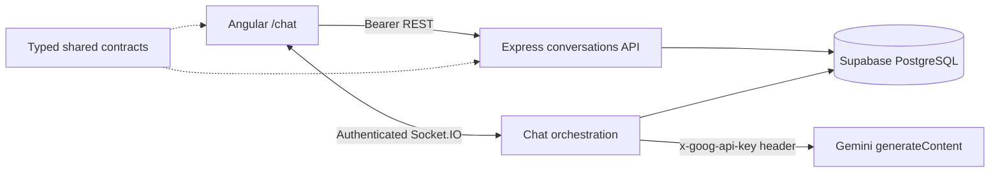

# Voice Chat Foundation

Angular 18 + Express/TypeScript application for English practice. This phase includes authenticated text conversations with Gemini, persisted in Supabase and delivered in real time through Socket.IO.

## Prerequisites

- Node.js 20+ and npm 10+
- A Supabase project where migrations `001` and `002` can be applied in order
- A Google Gemini API key
- A browser for manual UI verification

All dependency versions are exact. Gemini uses Node 20 native `fetch`; no AI SDK or frontend secret is required.

## Quick start

1. Run `npm install` in the repository root.
2. Copy `backend/.env.example` to `backend/.env` and replace the placeholders locally.
3. Copy `frontend/src/environments/environment.example.ts` to `frontend/src/environments/environment.ts` and configure only the API/socket/Supabase public URLs and anon key.
4. Apply `backend/migrations/001_initial_schema.sql`, then `backend/migrations/002_chat_turn_idempotency.sql`, in that order. For an existing installation where `001` is already applied, apply only `002`; its additions are safe to rerun defensively.
5. Optionally run `npm run seed`.
6. Run `npm run dev`, sign in, and open <http://localhost:4200/chat>.

Do not commit `.env`. Gemini and Supabase service-role keys must never be copied into frontend files, browser code, Git, screenshots, or chat messages. If a key has been exposed, revoke/rotate it in its provider console and update only the local backend environment.

## Architecture and chat flow

1. Angular lists/creates conversations and loads persisted history over protected REST.
2. `chat:send` carries only `conversationId`, text content, and a browser-generated `clientMessageId`.
3. Socket authentication is authoritative: the backend takes `userId` only from `socket.data`, and every chat persistence lookup/write revalidates conversation ownership.
4. The client ID persistently identifies the user row. A retry emits that same row; if its linked assistant response already exists, both persisted rows are emitted without calling Gemini. If only the user row exists after a disconnect or provider failure, the backend resumes generation and links the response to it.
5. A local per-conversation busy guard avoids redundant work in one process. Across multiple backend instances, concurrent generation is possible, but database uniqueness allows only one assistant row; every contender recovers and emits the winning row.
6. `chat:error` is sanitized and correlated. The UI deduplicates persisted messages by database ID.

The service-role database client bypasses RLS, so ownership is explicitly revalidated in chat database methods. Messages are ordered by `timestamp`, then `id`. Migration `002` adds role-constrained idempotency/link columns and partial unique indexes without modifying the already-applied initial schema.

## Environment variables

### Backend (`backend/.env`)

| Variable               | Purpose                                | Example                          |
| ---------------------- | -------------------------------------- | -------------------------------- |
| `PORT`                 | Express and Socket.IO port             | `3000`                           |
| `NODE_ENV`             | Error/log behavior                     | `development`                    |
| `FRONTEND_URL`         | Exact allowed CORS origin              | `http://localhost:4200`          |
| `SUPABASE_URL`         | Supabase project URL                   | `https://project.supabase.co`    |
| `SUPABASE_ANON_KEY`    | Reserved user-scoped credential        | Supabase anon key                |
| `SUPABASE_SERVICE_KEY` | Server-only database credential        | Supabase service-role key        |
| `GEMINI_API_KEY`       | Server-only Gemini credential          | local secret, never frontend/Git |
| `GEMINI_MODEL`         | Gemini model used by `generateContent` | `gemini-3.5-flash-lite`          |

`GEMINI_MODEL` defaults to `gemini-3.5-flash-lite`. Configuration is validated on the first chat turn, not at server startup. Rotate a Gemini key in Google AI Studio/Cloud, replace the local `GEMINI_API_KEY`, and restart the backend. Never put either server key in Angular's environment.

### Frontend environment

`frontend/src/environments/environment.ts` contains `apiUrl`, `socketUrl`, `supabaseUrl`, and `supabaseAnonKey`. It intentionally contains no Gemini key or service-role key.

## API and Socket.IO

REST envelopes are `{ success: true, data }` and `{ success: false, error: { code, message } }`.

| Method | Route                                         | Authentication         |
| ------ | --------------------------------------------- | ---------------------- |
| GET    | `/health`                                     | None                   |
| POST   | `/api/auth/signup`                            | None                   |
| POST   | `/api/auth/login`                             | None                   |
| POST   | `/api/auth/logout`                            | Bearer JWT             |
| GET    | `/api/auth/me`                                | Bearer JWT             |
| GET    | `/api/conversations`                          | Bearer JWT             |
| POST   | `/api/conversations`                          | Bearer JWT             |
| GET    | `/api/conversations/:conversationId/messages` | Bearer JWT + ownership |

Socket events retain `ping`/`pong` and add `chat:send`, `chat:message`, `chat:typing`, and `chat:error`. Inputs are UUID/content validated; client-supplied roles or user IDs are never accepted.

## Scripts

| Command                                   | Purpose                                                                        |
| ----------------------------------------- | ------------------------------------------------------------------------------ |
| `npm run dev`                             | Start frontend/backend development servers                                     |
| `npm run build`                           | Build shared, backend, then frontend                                           |
| `npm run lint`                            | Lint all workspaces                                                            |
| `npm run format` / `npm run format:check` | Write/check Prettier formatting                                                |
| `npm run test`                            | Run configured workspace checks (optional suites remain intentionally omitted) |
| `npm run seed`                            | Seed the configured Supabase project                                           |

## Manual verification

These checks need real credentials/network and are not established by static validation:

1. Configure a valid backend-only Gemini key and Supabase credentials; start `npm run dev`.
2. Sign up or log in, confirm the authenticated nav shows **Chat**, and open `/chat`.
3. Confirm the newest conversation is selected, or one is automatically created for a new user.
4. Send English text and observe the persisted user bubble, Gemini typing indicator, assistant reply, and scroll-to-bottom behavior.
5. Reload and confirm history is restored without duplicates. Retry the same `clientMessageId` and confirm no duplicate user or assistant row is created; interrupt a turn after the user row is stored, retry it, and confirm the missing reply resumes. Create and switch between conversations.
6. Disconnect the backend and confirm sending is disabled/error feedback remains friendly; restart and verify reconnection.
7. Use a second user's conversation UUID against REST/socket and confirm no data is disclosed.
8. Inspect browser requests/bundles: no `GEMINI_API_KEY` or `SUPABASE_SERVICE_KEY` may appear. Inspect Gemini requests server-side and confirm the API key is in `x-goog-api-key`, never the URL.
9. Test an invalid/missing Gemini key and a timeout; confirm correlated `chat:error`, typing cleanup, and ability to retry.

## Troubleshooting

- **Gemini is not configured:** set `GEMINI_API_KEY` only in the backend local environment and restart.
- **Gemini generation failure:** verify key permissions/model availability and `GEMINI_MODEL`; public errors intentionally hide provider details.
- **401/expired token:** clear `voice_chat_token`, then log in again.
- **CORS/socket failure:** ensure `FRONTEND_URL` exactly matches the browser origin and frontend API/socket URLs target the backend.
- **Missing relation/column:** apply `001_initial_schema.sql` and then `002_chat_turn_idempotency.sql` to the intended Supabase project. Existing projects with `001` already applied need only `002`.
- **Turn stopped after the user message:** resend with the same `clientMessageId`; the persisted user row is reused and the missing assistant response resumes. Do not generate a new client ID for that retry.
- **Port in use:** stop the occupying process or update backend and frontend URLs together.
